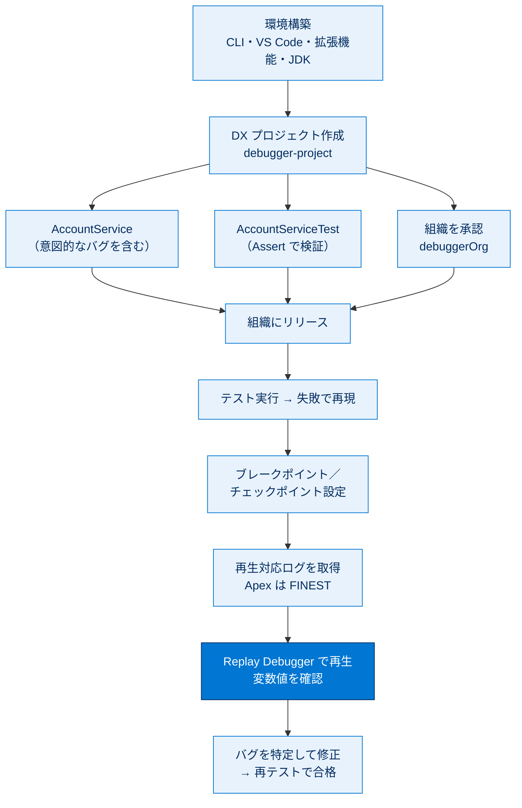

# Apex Replay Debugger でバグを見つけて修正する 総まとめ

このトピックでは、デバッグとテストの違いを整理したうえで、無料の **Apex Replay Debugger** を Visual Studio Code で動かすための環境を構築し、意図的にバグを仕込んだ Apex クラスをテストで再現しました。さらに、ブレークポイントとチェックポイントを設定して再生対応のデバッグログを取得し、ログを「巻き戻し再生」して変数値の不一致からバグを特定し、修正してテスト合格まで導く一連の流れを体験しました。デバッグログを後から再生するという独特の方式と、再生に必要なログレベルや各種上限値が試験で問われます。

---

## 全体像

次の図は、環境構築からバグの発見・修正までの大きな流れと、登場する主要概念の関係を 1 枚で俯瞰したものです。

---

## ユニット横断 早見表

| ユニット | 学んだこと | キーワード | 一言要点 |
| --- | --- | --- | --- |
| **01 Trailhead Playground の起動** | デバッグとテストの違い、Replay Debugger の正体、Replay と Interactive の比較 | デバッグ／デバッグログ／追跡フラグ／再生 | バグは「録画して巻き戻し再生」で追う。Apex ログは FINEST。 |
| **02 Visual Studio Code の設定** | 必要な 4 つの道具のインストールと Java ホーム設定 | CLI／VS Code／Extension Pack／JDK 21 | 4 点をそろえ `salesforcedx-vscode-apex.java.home` を設定。 |
| **03 Apex Replay Debugger を設定する** | DX プロジェクト・バグ入りクラス・テストの作成、組織の承認 | DX プロジェクト／AccountService／Assert／debuggerOrg | わざとバグ（`TickerSymbol = accountNumber`）を仕込む。 |
| **04 コードをデバッグする** | リリース・テスト失敗の再現・各種ポイント設定・ログ再生・修正 | ブレークポイント／チェックポイント／ヒープダンプ／コールスタック | 入力と出力の不一致から代入ミスを特定し修正・合格。 |

---

## 🎯 試験頻出ポイント

> [!ポイント] このトピックで狙われやすい論点・暗記値
>
> - **テスト**はエラーを見つけて報告する作業、**デバッグ**は原因を突き止めて修正する作業（別プロセス）。
> - **Apex Replay Debugger は無料**。デバッグログを後から再生する方式で、リアルタイムには止めない。
> - リアルタイムに停止したいなら **Apex Interactive Debugger（有料・要問い合わせ）**。ISV 向けのカスタマーデバッガーもある。
> - 再生対応ログのログレベル：**Apex コードは FINEST**、**Visualforce は FINER または FINEST**。
> - **ブレークポイントは無制限／チェックポイントは最大 5 個**。チェックポイントはヒープダンプを取得し情報量が多い。
> - **チェックポイントは 30 分・ヒープダンプは 1 日**で失効する。設定したら速やかにログ取得・再生する。
> - チェックポイントを切り替えたら **[SFDX: Update Checkpoints in Org]** で組織と同期する。
> - 再生対応ログは **[SFDX: Turn On Apex Debug Log for Replay Debugger]** で有効化（追跡フラグを作成）。
> - デバッグログは**共有でき、他の開発者が取得したログを自分の環境で再生**して非同期に協力できる。
> - 環境構築に必要な 4 点：**Salesforce CLI / VS Code / Salesforce Extension Pack / JDK（21 推奨）**。
> - Apex クラスは **[SFDX: Create Apex Class]** で作成する（`.cls` と `.cls-meta.xml` が必要）。

---

## 📖 用語早見表

| 用語 | ひとことの意味 |
| --- | --- |
| **デバッグ（Debugging）** | バグの原因を特定して取り除く作業。 |
| **Apex Replay Debugger** | デバッグログを後から再生してデバッグする無料ツール（VS Code がクライアント）。 |
| **Apex Interactive Debugger** | 実行をリアルタイムに停止できる有料デバッガー。 |
| **デバッグログ（Debug Log）** | 実行トランザクションの詳細な時系列記録。再生の「録画テープ」。 |
| **追跡フラグ（Trace Flag）** | いつ・誰の・どのカテゴリを・どの詳細レベルで記録するかの設定。 |
| **ログレベル** | ログの詳細度。再生には Apex で FINEST、Visualforce で FINER 以上が必要。 |
| **Salesforce CLI** | `sf` コマンドで組織を操作・デプロイ・テストするツール。 |
| **Salesforce Extension Pack** | VS Code に Apex 開発・デバッグ機能をまとめて追加する拡張機能群。 |
| **JDK** | Apex 言語サポートが内部で使う Java の開発キット（21 推奨）。 |
| **Salesforce DX プロジェクト** | ソースやメタデータをローカルのフォルダー構造で管理する形式。 |
| **Apex クラス** | Apex コードをまとめる入れ物（`.cls` と `.cls-meta.xml`）。 |
| **Apex テスト** | `@IsTest` と `Assert` でコードの動作を自動検証するコード。 |
| **ブレークポイント** | 実行を指定行で一時停止させる目印（個数は無制限）。 |
| **チェックポイント** | ヒープダンプも取得する Apex 専用ブレークポイント（最大 5 個）。 |
| **ヒープダンプ（Heap Dump）** | ある瞬間のメモリ上の変数・オブジェクト状態の記録。 |
| **コールスタック（Call Stack）** | 実行中メソッドが「どこから呼ばれたか」の連なり。 |

---

> [!豆知識] 「巻き戻し再生」がサーバー言語に効く理由
>
> Apex はサーバー側で一瞬で実行されるため、実行中に変数をのぞき込むのが難しい言語です。Replay Debugger は処理を一度デバッグログとして「録画」し、後からそれを一行ずつ「巻き戻し再生」します。スポーツの試合をビデオで見返して好きな場面で一時停止するのと同じ発想で、ライブ接続なしでも変数値やコールスタックを追えます。

> [!豆知識] 「バグ」は本物の虫が語源
>
> 不具合を「バグ（虫）」と呼ぶのは、1947 年に計算機 Mark II のリレーに本物の蛾が挟まり誤動作した逸話に由来するとされます。記録には「First actual case of bug being found」と残されました。デバッグ（debug）＝「虫を取り除く」という言葉のニュアンスはここに通じています。

> [!豆知識] ログを渡すだけで遠隔協力できる
>
> Replay Debugger は再生対応デバッグログさえあれば誰の環境でも再生できます。つまりバグに遭遇した開発者がログを生成・共有すれば、別の開発者が自分の VS Code でそのログを開いて調査できます。リアルタイム接続が前提の Interactive Debugger と違い、時差のあるチームでも非同期にデバッグを引き継げるのが利点です。

---

## ✅ 理解度セルフチェック

> [!まとめ] 答えながら知識を確認しよう（答えは各項目の末尾）
>
> 1. Apex Replay Debugger は有料ですか、無料ですか？ → **無料**（リアルタイム停止の Interactive Debugger は有料）。
> 2. 再生対応ログに必要なログレベルは、Apex コードでは何ですか？ → **FINEST**（Visualforce は FINER または FINEST）。
> 3. ブレークポイントとチェックポイント、同時に設定できる個数に上限があるのはどちらで、いくつまでですか？ → **チェックポイントが最大 5 個**（ブレークポイントは無制限）。
> 4. チェックポイントとヒープダンプの有効期限はそれぞれ何分／何日ですか？ → **チェックポイントは 30 分、ヒープダンプは 1 日**。
> 5. 今回のバグは `AccountService` のどの行でしたか？ → `TickerSymbol = accountNumber`（正しくは `TickerSymbol = tickerSymbol`）。
> 6. 環境構築に必要な 4 つの道具は何ですか？ → **Salesforce CLI・VS Code・Salesforce Extension Pack・JDK（21 推奨）**。
