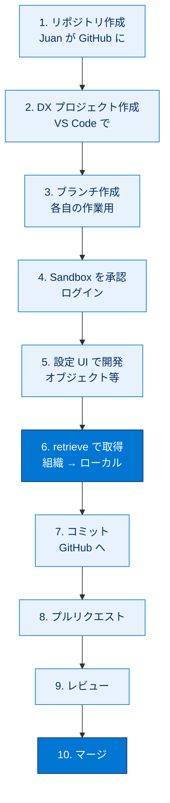
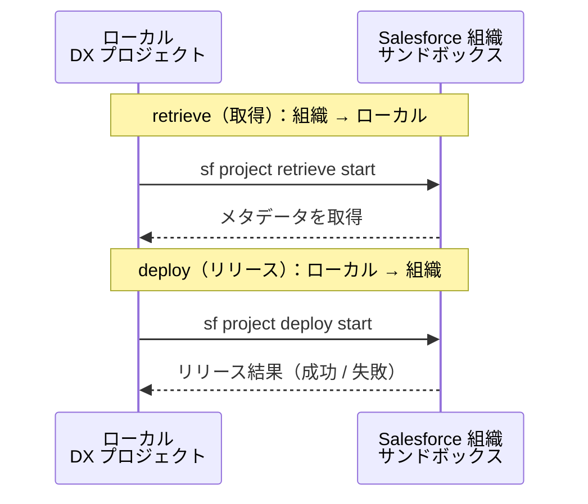
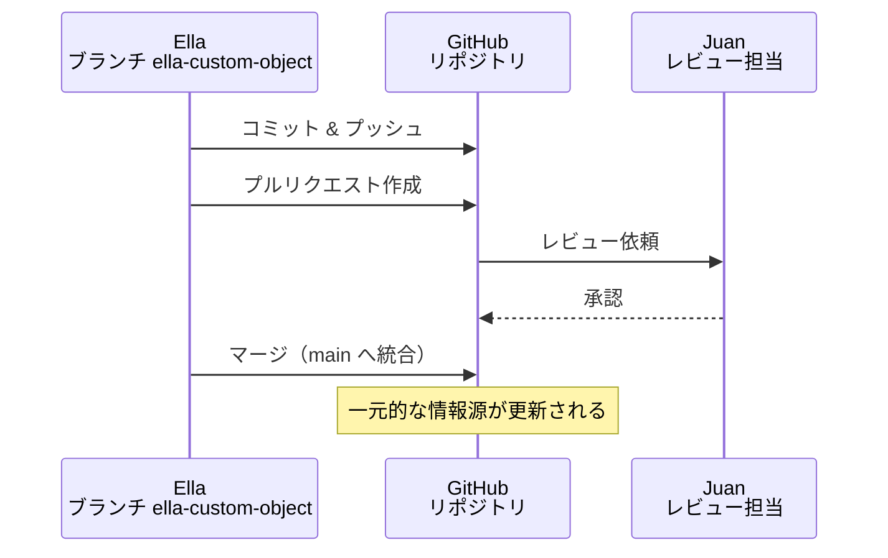

# ローカルで変更を開発してテストする

## 学習の目的

この単元を完了すると、次のことができるようになります。

- ソース制御リポジトリを作成し、Salesforce DX プロジェクトを追加する。
- VS Code 向け Salesforce 拡張機能で Sandbox を承認する。
- Sandbox から変更を取得する（retrieve）。
- 変更リストで自分の変更を追跡し、ソース制御にコミットしてプルリクエストを作成する。
- Apex トリガーを作成し、Developer Sandbox にリリースする（deploy）。

> [!ポイント] この単元のゴール
>
> 2人の開発者（Ella と Juan）が組織開発モデルのワークフローを**一巡**します。「**ブランチを作る → サンドボックスから取得 → ローカルで開発 → コミット → プルリクエスト → マージ**」という流れと、`sf project retrieve start`（取得）と `sf project deploy start`（リリース）の違いが試験対策の要です。

> [!注意] このモジュールにハンズオン Challenge はありません
>
> このモジュールの主目的は組織開発モデルのワークフローを示すことで、ハンズオン Challenge はありません。手順を試したい場合は、各 Sandbox の代わりに **Developer Edition 組織または Trailhead Playground** にサインアップして使ってください。Sandbox は「本当の」開発作業用に残しておきます。

---

## このストーリーの全体像



> [!用語] 取得（retrieve）とリリース（deploy）
>
> - **取得（retrieve）**：組織（サンドボックス）の変更を、**ローカルの DX プロジェクトに持ってくる**こと（組織 → ローカル）。コマンドは `sf project retrieve start`。
> - **リリース（deploy / デプロイ）**：ローカルの変更を、**組織へ送り込む**こと（ローカル → 組織）。コマンドは `sf project deploy start`。
>
> 矢印の向きが逆である点を必ず区別してください。



---

## コードリポジトリを設定する

開発チームは GitHub でコードをホストし、変更をコミット・マージしてから作業を続けます。

> [!用語] リポジトリ（Repository）
>
> ソースファイルとその変更履歴を保管する「保管庫」。プロジェクト単位で1つ作るのが一般的。GitHub の非公開（private）リポジトリにすれば社内チームだけがアクセスできます。

### ソース制御リポジトリを作成する

Juan は Zephyrus の Enterprise アカウントで `language-courses` という非公開リポジトリを作成します。リポジトリ名は目的が伝わる名前にします（後からチームメンバーが用途を理解でき、複数リポジトリでも迷いません）。

### Salesforce DX プロジェクトを作成する

> [!手順] VS Code で DX プロジェクトを作成する
>
> 1. VS Code を開く。
> 2. **[View（表示）]** | **[Command Palette（コマンドパレット）]** を選択する。
> 3. 検索ボックスに `sfdx project` と入力する。
> 4. **[SFDX: Create Project with Manifest（マニフェストを使用したプロジェクトの作成）]** を選択する。
> 5. GitHub リポジトリと同じ名前 `language-courses` を使用し、**[Enter]** をクリックする。
> 6. **[Create Project（プロジェクトを作成）]** をクリックする。

> [!ポイント] 「with Manifest」を選ぶ理由
>
> **[Create Project with Manifest]** を選ぶと、`manifest/package.xml`（取得・リリース対象を記述するマニフェスト）があらかじめ用意された状態でプロジェクトが作られます。後でメタデータを取得・リリースするときに便利です。

### プロジェクトファイルを GitHub のリポジトリに追加する

> [!手順] DX プロジェクトを Git で初期化して GitHub に公開する
>
> 1. VS Code で DX プロジェクトディレクトリを開き、**[Source Control（ソース制御）]** アイコンをクリックする。
> 2. **[Initialize Repository（リポジトリの初期化）]** をクリックする。
> 3. **[変更]** の上で **[+]** をクリックし、すべての変更をステージングする。
> 4. デフォルトブランチ（`main` など）を受け入れる。
> 5. コミットメッセージを入力し、**[Commit]** アイコン（チェックマーク）をクリックする。
> 6. **[Publish Branch（ブランチを公開）]** をクリックする。
> 7. ブランチを公開する場所を確認する。

> [!用語] ステージング（Staging）／ブランチ（Branch）
>
> **ステージング**は、コミットに含めたい変更を「コミット直前の置き場」に登録する操作（`git add` 相当）。`[+]` で**必要な変更だけ選んでコミット**できます。**ブランチ**は本流（`main` など）から枝分かれさせた作業ライン。各自が自分のブランチで作業すれば他人に影響を与えず、後でマージして統合できます。

---

## 新しい要件に対応するカスタマイズを作成する

営業チームから「語学コースが追加・変更されたとき通知を受けたい」「各コースの担当講師を知りたい」という要望が出ました。Juan はこれを組織開発モデルのワークフローを学ぶ題材とし、作業を2人で分担します。

> [!例] 2人の開発者の作業分担
>
> | 開発者 | 担当する作業 | 作成するメタデータ |
> | --- | --- | --- |
> | **Ella** | 語学コースインストラクターのオブジェクトを作り、コースと関連付ける | CustomObject、CustomField（主従関係） |
> | **Juan** | コース変更時に営業チームへ通知するトリガーを作る | ApexTrigger、ApexClass（テスト） |

---

## Ella の作業 (1)：リポジトリをコピーする

> [!手順] リポジトリをクローンして自分のブランチを作る
>
> 1. コピーするリポジトリ（例：`https://github.com/zephyrus/language-courses`）にアクセスする。
> 2. **[Clone or download]** をクリックする。
> 3. HTTPS URL をコピーする。
> 4. VS Code のコマンドパレットから **[Git: Clone]** を選択する。
> 5. **[Repository URL]** に URL を貼り付けて **[入力]** をクリックする。Ella は `https://github.com/zephyrus/language-courses.git` をコピーする。
> 6. リポジトリを配置する場所に移動し、**[Select Repository Location]** をクリックする。
> 7. **[Open Repository]** をクリックする。
> 8. コマンドパレットから **[Git: Create Branch]** をクリックする。
> 9. ブランチ名を入力する。Ella は `ella-custom-object` とした。

> [!用語] クローン（Clone）
>
> リモート（GitHub）のリポジトリの完全なコピーを自分の PC（ローカル）にダウンロードすること。履歴ごと手元に複製され、ローカルで作業できます。

> [!注意] このリポジトリは説明用のサンプルです
>
> `https://github.com/zephyrus/language-courses` は**実在せず説明用**です。同じ手順を実行する場合は、このコースで作成したサンプルリポジトリで代用してください。Juan と Ella 2人の作業をシミュレートするため、親ディレクトリを2つ（例：`org-dev-ella`、`org-dev-juan`）作って分担することをお勧めします。

---

## Ella の作業 (2)：Sandbox を承認してログインする

> [!用語] 組織の承認（Authorize an Org）
>
> VS Code / CLI に「この組織を操作してよい」という許可を与えてログインしておくこと。一度承認すれば、以後はその**別名（エイリアス）** を指定するだけで取得・リリースができます。

> [!手順] Developer Sandbox を承認する
>
> 1. コマンドパレットの検索ボックスに `sfdx authorize` と入力する。
> 2. **[SFDX: Authorize an Org（組織を承認）]** を選択する。
> 3. ログイン URL に **[Sandbox]** を選択する。
> 4. Sandbox の別名（`dev_sandbox` など）を入力する。
> 5. Sandbox のユーザー名とパスワードでログインする。

> [!注意] サンドボックスとログイン URL の対応
>
> 同じ手順を試す場合は Developer Edition 組織または Trailhead Playground を使い、ステップ 3 で **[Project Default]** を選んで `login.salesforce.com` を使います。**本番組織・Developer Edition・Playground は `login.salesforce.com`、サンドボックスは `test.salesforce.com`** という対応を覚えておきましょう。

---

## Ella の作業 (3)：カスタムオブジェクトの作成

> [!用語] カスタムオブジェクト（Custom Object）
>
> 標準にはない組織独自のデータを格納する入れ物（テーブルに相当）。API 名は末尾に `__c` が付きます（例：`Language_Course_Instructor__c`）。

> [!手順] 語学コースインストラクター オブジェクトを作成する
>
> 1. **[Setup（設定）]** から **[Object Manager（オブジェクトマネージャー）]** タブをクリックする。
> 2. 右上の **[作成]** | **[カスタムオブジェクト]** をクリックする。
> 3. **[Label（表示ラベル）]** に `Language Course Instructor`（語学コースインストラクター）と入力する。
> 4. **[Plural Label（表示ラベル（複数形））]** に `Language Course Instructors` と入力する。
> 5. **[新規カスタムタブウィザードを起動する]** をオンにして **[保存]** をクリックする。
> 6. タブスタイルを選択し（Ella は **[プレゼンター]**）、保存できるまで **[次へ]** をクリックする。

> [!ポイント] `schema generate` でローカルから生成することもできる
>
> `schema generate` コマンドで、新しいカスタムオブジェクト・項目・タブ・プラットフォームイベントのローカルソースファイルを生成できます。このモジュールでは設定（宣言型 UI）をお勧めしますが、後でコマンドも試してみてください。

### カスタム項目を定義する

Ella は Language Course Instructor を参照する Language Course オブジェクトのカスタム項目を定義します。

> [!注意] 前提：Language Course オブジェクトが存在すること
>
> Ella は別のモジュールで Language Course オブジェクトを作成しています。続行前に、このオブジェクトが Developer Sandbox に存在することを確認してください。

> [!手順] Language Course オブジェクトと主従関係項目を作成する
>
> 1. **[Setup]** から **[Object Manager]** タブをクリックする。
> 2. 右上の **[作成]** | **[カスタムオブジェクト]** をクリックする。
> 3. **[Label]** に `Language Course`（語学コース）と入力する。
> 4. **[Plural Label]** に `Language Courses` と入力する。
> 5. **[新規カスタムタブウィザードを起動する]** をオンにして **[保存]** をクリックする。
> 6. タブスタイルを選択し（Ella は **[Chalkboard（黒板）]**）、保存できるまで **[Next]** をクリックする。
> 7. **[Object Manager]** | **[Language Course]** に移動する。
> 8. **[項目とリレーション]** をクリックする。
> 9. **[新規]** をクリックする。
> 10. **[データ型]** で **[主従関係]** を選択し **[次へ]** をクリックする。
> 11. **[関連先]** で **[Language Course Instructor]** を選択し **[次へ]** をクリックする。
> 12. 次のように入力する。
>     - 項目の表示ラベル：`Course Instructor`
>     - 説明：`Teacher for the language course`
> 13. 保存できるまで **[次へ]** をクリックする。

> [!用語] 主従関係（Master-Detail Relationship）
>
> 親（主）と子（従）を強く結びつけるリレーション。子は必ず親を持ち、親を削除すると子も削除されます。ここでは Language Course（コース）が子、Language Course Instructor（講師）が親となるよう、コース側に主従関係項目を作っています。

---

## Ella の作業 (4)：変更リストで変更を追跡する

> [!ポイント] 変更リストはなぜ重要か
>
> 設定 UI で作業するとメタデータがあちこちに作られます。**何を作ったかを変更リストに記録**しないと、後でローカルへ取得（retrieve）するとき「どれを取ればよいか」が分からなくなります。変更リストは「外部化すべき項目のチェックリスト」です。

| メタデータ型 | オブジェクト | 変更のタイプ | 詳細 |
| --- | --- | --- | --- |
| CustomObject | `Language_Course_Instructor__c` | 作成 | コースの講師の名前を取得するためのオブジェクト |
| CustomField | `Course_Instructor__c` | 作成 | `Language_Course__c` カスタムオブジェクトとの主従関係 |

---

## Ella の作業 (5)：Developer Sandbox から変更を取得する

Ella は変更リストで何を取得すればよいか把握しているため、CLI の `project retrieve start` で数個のコンポーネントを取得します。GitHub では空フォルダーを追加できないため、`force-app` フォルダーをローカルに作成します。

> [!手順] CLI で新しいオブジェクトと項目を取得する
>
> 1. ローカルの DX プロジェクトで `force-app` フォルダーを作成する。
> 2. VS Code ターミナルで次の CLI コマンドを実行する。

```bash
# CustomObject と CustomField を指定して、組織からローカルへ取得（retrieve）する
sf project retrieve start --metadata CustomObject:Language_Course_Instructor__c --metadata CustomField:Language_Course__c.Course_Instructor__c
```

Ella は `--source-dir` ではなく `--metadata` を使います（`--source-dir` は既存ファイルしか取得できないため）。カスタムオブジェクトは `force-app/main/default/objects` に表示されます。

> [!ポイント] `--metadata` と `--source-dir` の違い
>
> - `--metadata`：**メタデータ型と名前**で指定。ローカルにファイルがまだ無くても取得できる（新規取得向き）。
> - `--source-dir`：**ローカルにすでにあるファイル（パス）** を指定。新規のメタデータは取れない。
>
> 「初めて取ってくるものは `--metadata`」と覚えます。

---

## Ella の作業 (6)：ソース制御リポジトリに変更をコミットする

> [!手順] 変更をコミットしてプッシュする
>
> 1. VS Code で **[Source Control]** アイコンを選択する。
> 2. コミットコメントを入力し、**[Commit]** アイコンをクリックする。
> 3. **[はい]** をクリックしてファイルを追加してコミットする。
> 4. コマンドパレットから **[Git: Push To]** を選択する。
> 5. オリジンリポジトリを選択する。

> [!用語] プッシュ（Push）／オリジン（Origin）
>
> **プッシュ**は、ローカルでコミットした変更を**リモート（GitHub）に送る**操作。**オリジン**は、クローン元のリモートリポジトリに付けられる既定の名前です。

### コードをレビューする

> [!注意] 1人で手順を試している場合
>
> 1人で実行している場合は、このレビューのセクションをスキップできます（レビュー担当者がいないため）。

> [!手順] プルリクエストを作成してレビューを依頼する
>
> 1. GitHub リポジトリで **[Compare & pull request]** をクリックする。
> 2. レビュー担当者を割り当てる（Ella は Juan に依頼）。
> 3. レビュー担当者へのコメントを入力する。
> 4. **[Create pull request]** をクリックする。

> [!用語] プルリクエスト（Pull Request：PR）
>
> 「自分のブランチの変更を本流に取り込んでほしい」という依頼。レビュー担当者が確認・承認してからマージするため、品質を保ちつつ安全に統合できます。

Juan がレビューして承認すると、Ella はプルリクエストをマージします。

---

## Juan の作業 (1)：トリガーを作成する

コースが追加・更新・削除されると、トリガーが営業チームに通知します。

> [!用語] Apex トリガー／Apex
>
> **Apex トリガー**は、レコードが**挿入（insert）・更新（update）・削除（delete）** される**前（before）／後（after）** に自動実行される Apex コード。ここでは「コースが追加・更新・削除されたら営業チームへ通知」を実現します。**Apex** は Salesforce のサーバーサイド処理を書く Java に似た言語で、トリガーやテストクラスを記述します。

Juan は GitHub リポジトリをコピーして自分用のブランチを作り、トリガーと対応するテストを作成します。

### プロジェクトリポジトリを Developer Sandbox にリリースする

まず Juan は Ella の変更を自分の Developer Sandbox にリリースし、環境を同期させます。

> [!注意] 同じ手順を試す場合
>
> `org-dev-juan` のような Juan 用フォルダーで実行してください。Juan の Developer Sandbox には、新しい Developer Edition 組織または Trailhead Playground を使います。

> [!手順] リポジトリをコピーしてブランチを作り、Ella の変更を自分の Sandbox にリリースする
>
> 1. GitHub リポジトリをコピーする。
> 2. **[Git: Create Branch]** でブランチ名を指定する。Juan は `juan_apex_trigger` にする。
> 3. **[SFDX: Authorize an Org]** を選択する。
> 4. ログイン URL（`test.salesforce.com`）に **[Sandbox]** を選択する。
> 5. Sandbox の別名（`dev_sandbox` など）を入力する。
> 6. Sandbox のユーザー名とパスワードでログインする。
> 7. Ella の変更を Juan の Sandbox にリリースする。`objects` フォルダーを右クリックして **[SFDX: Deploy Source to Org]** を選択するか、次の CLI コマンドを実行する。

```bash
# ローカルにある Ella の変更（オブジェクトと項目）を Juan の Sandbox へリリース（deploy）する
sf project deploy start --metadata CustomObject:Language_Course_Instructor__c --metadata CustomField:Language_Course__c.Course_Instructor__c
```

> [!例] なぜ Juan はまず Ella の変更を取り込むのか
>
> Juan のトリガーは Ella が作った `Language_Course__c` オブジェクトに対して動きます。先に Ella のオブジェクトを自分の Sandbox にそろえないとトリガーがコンパイルできません。これが「環境を同期させる」作業です。

### トリガーを構築する

> [!手順] Apex トリガーを作成する
>
> 1. `juan_apex_trigger` ブランチで、トリガーを配置するディレクトリを作成する。
> 2. `force-app` フォルダーを展開する。
> 3. `default` を右クリックして **[New Folder]** を選択する。
> 4. `triggers` と入力する。
> 5. `triggers` フォルダーを右クリックして **[SFDX: Create Apex Trigger]** をクリックする。
> 6. トリガー名に `LanguageCourseTrigger` と入力し、コードを入力する。

```apex
// Language_Course__c に対し、挿入・更新・削除の「後（after）」に実行されるトリガー
trigger LanguageCourseTrigger on Language_Course__c (after insert, after update, after delete) {
    // <write your own notification code>
    // ここに営業チームへ通知メールを送る独自の処理を記述する
}
```

> [!手順] 続き
>
> 7. ファイルを保存する。
> 8. `TestLanguageCourseTrigger` というトリガー用のテストを作成し、コードカバー率要件を満たすことを確認する。

> [!用語] コードカバー率（Code Coverage）
>
> Apex コードのうちテストで実行された行の割合。本番リリース時には**組織全体で 75% 以上**が必要です。だからトリガーには対応するテストクラス（`TestLanguageCourseTrigger`）が必須です。

### 変更を Developer Sandbox にリリースする

> [!手順] トリガーを Sandbox にリリースする
>
> 1. `triggers` フォルダーを右クリックして **[SFDX: Deploy This Source to Org]** を選択するか、次の CLI コマンドを実行する。

```bash
# triggers フォルダー配下のソースを組織へリリース（deploy）する
sf project deploy start --source-dir force-app/main/default/triggers
```

Juan は動作を確認し、自分の変更を変更リストに追加します。

| メタデータ型 | オブジェクト | 変更のタイプ | 詳細 |
| --- | --- | --- | --- |
| CustomObject | `Language_Course_Instructor__c` | 作成 | コースの講師を取得するオブジェクト |
| CustomField | `Course_Instructor__c` | 作成 | `Language_Course__c` カスタムオブジェクトとの主従関係 |
| ApexTrigger | `LanguageCourseTrigger` | 作成 | `Language_Course__c` が作成・更新・削除されたとき営業チームにメール送信 |
| ApexClass | `TestLanguageCourseTrigger` | 作成 | トリガーの Apex テストカバー率 |

> [!注意] ここでも `--source-dir` を使っている
>
> `triggers` フォルダーをローカルに作成済みなので、パス指定の `--source-dir` でリリースできます。一方 Ella が新規取得したときは `--metadata` でした。「ローカルにファイルがあるか」で使い分けます。

### ソース制御リポジトリに変更をコミットする

Juan は変更をコミットしてプルリクエストを作成し、Ella がコードレビューを実施します。

---

## 次のリリースを計画する

> [!例] 作業の作り方で取得・リリースの向きが変わる
>
> - **VS Code でコードを書いた場合**（例：トリガー）：ローカル → Sandbox に **deploy** して動作確認。
> - **設定 UI で宣言的に作った場合**（例：オブジェクト・項目）：Sandbox → ローカルに **retrieve** して取り込み。
>
> どちらも最後はコミット → PR → レビュー → マージでソース制御に集約します。



---

## 試験対策：押さえておきたい追加ポイント

> [!ポイント] retrieve と deploy のまとめ
>
> | コマンド | 向き | 役割 | 主なフラグ |
> | --- | --- | --- | --- |
> | `sf project retrieve start` | 組織 → ローカル | 取得 | `--metadata` / `--source-dir` |
> | `sf project deploy start` | ローカル → 組織 | リリース | `--metadata` / `--source-dir` / `--manifest` |

> [!ポイント] ワークフローの頻出ポイント
>
> - プロジェクト開始時、まず **DX プロジェクトを作成（またはクローン）し、自分のブランチを作る**（変更前に必要な重要手順）。
> - 変更を共有するには、**Sandbox からソースリポジトリのプロジェクトに取り込み（retrieve）、コミット → PR → マージ**する。各メンバーの Sandbox に直接配るのではない。
> - ログイン URL は **サンドボックス = `test.salesforce.com`、本番/DE/Playground = `login.salesforce.com`**。
> - 本番リリースには Apex の **コードカバー率 75% 以上**が必要なので、トリガーにはテストクラスが必須。

---

## リソース

- Trailhead: Git と GitHub の基本
- GitHub: GitHub Docs
- Trailhead: Apex トリガー入門
- Trailhead: Apex トリガーをテストする

---

## テスト

この単元を完了するには、テストのすべての質問に正しく解答する必要があります（+100 ポイント）。

**1. プロジェクトが開始されると、デベロッパーは変更を行う前にどの重要な手順を実行する必要がありますか?**

- A. コード用に新しい GitHub リポジトリを作成してから、ブランチを作成する。
- B. リポジトリの変更を Developer Sandbox にリリースする。
- C. 独自の Salesforce DX プロジェクトを作成する。
- D. 他の開発者から提供されたコードをすべてリファクタリングする。

**2. デベロッパーが Sandbox 組織で変更を行った後、その変更を他のユーザーと共有するにはどの手順が必要ですか?**

- A. 新しいブランチの作成をソース制御システムで行い、新しい DX プロジェクトを作成する。
- B. 変更をテストする前に、クリーンなテスト組織にプッシュする。
- C. 変更をすべてのチームメイトの各 Sandbox にリリースする。
- D. 変更を Sandbox からソースリポジトリのプロジェクトに取り込む。

> [!まとめ] この単元のまとめ
>
> - 開発の基本サイクルは「**クローン／DX プロジェクト作成 → ブランチ作成 → Sandbox 承認 → 開発 → retrieve/deploy → コミット → PR → レビュー → マージ**」。
> - **retrieve は組織→ローカル（取得）、deploy はローカル→組織（リリース）**。`--metadata`（新規取得・名前指定）と `--source-dir`（既存ファイル・パス指定）を使い分ける。
> - Ella はオブジェクト・項目を**設定 UI で作って retrieve**、Juan はトリガー・テストを**コードで書いて deploy**。最後はどちらもコミット → PR でマージ。
> - 各自の変更は**変更リスト**に記録し、Apex には**テスト（カバー率 75% 以上）** を用意する。

> [!注意] 日本語環境で受講する場合
>
> 手順の操作項目は英語名（かっこ内）も併記されています。試す場合はリポジトリ名・ブランチ名・API 名などの英語の値を正確に使用してください。サンドボックスの代わりに Developer Edition 組織または Trailhead Playground を使ってください。
