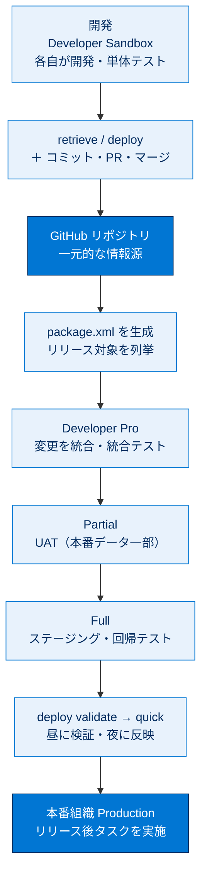

# 組織開発モデル 総まとめ

このトピックでは、本番組織を設定画面で直接カスタマイズするやり方から、**ソース制御リポジトリ（GitHub）を中心に据えたチーム開発**へ移行する「組織開発モデル」を、システム管理者 Calvin と開発者 Ella・Juan のストーリーを通して一気通貫で学びました。変更をソース制御で外部化し、サンドボックスをフェーズごとに使い分けながら、Salesforce DX プロジェクト・CLI・VS Code 拡張機能・Git を使って「開発 → テスト → リリース」を回します。最終的に `deploy validate` と `deploy quick` を組み合わせ、本番のダウンタイムを最小化してリリースするところまでが一連の流れです。

---

## トピック全体像

次の図は、組織開発モデルの「ソース制御を中心に、変更が開発からテストを経て本番へ流れる」全体構造を1枚で俯瞰したものです。

---

## ユニット横断 早見表

| ユニット | 学んだこと | キーワード | 一言要点 |
| --- | --- | --- | --- |
| **01 組織への変更を計画する** | 組織開発モデルの考え方、サンドボックスの使い分け、ツールと変更管理の仕組み | 外部化 / サンドボックス / DX プロジェクト / CLI / 変更リスト | 変更を**ソース制御で外部化**し、環境とツールを整える「準備」フェーズ |
| **02 ローカルで変更を開発してテストする** | ブランチ作成・組織承認・retrieve/deploy・コミット・PR・マージの基本サイクル | ブランチ / retrieve / deploy / `--metadata` / `--source-dir` / PR | 2人の開発者が**開発ワークフローを一巡**。取得とリリースの向きを区別 |
| **03 変更をテストしてリリースする** | package.xml の作成、段階的リリース、検証とクイックリリース | package.xml / validate / quick / test-level / リリース実行リスト | マージ済みの変更を**段階的にテストし本番へ**。ダウンタイムを最小化 |

---

## 🎯 試験頻出ポイント

> [!ポイント] このトピックで狙われやすい論点・暗記値
>
> - **組織開発モデルの核心**＝「変更をソース制御リポジトリで**外部化（一元管理）** する」こと。変更追跡・環境同期・変更セット作り直しの課題を解決する。
> - **ソース制御の利点**＝「複数人が同じファイルセットで同時に作業できる」「変更履歴が残る」「過去バージョンに戻せる」。
> - **サンドボックスの順序と内容**＝ `Developer`（メタのみ）→ `Developer Pro`（メタのみ・容量大）→ `Partial`（メタ＋本番データ一部）→ `Full`（メタ＋本番データ全部）。本番に近づくほどデータが増える。
> - **retrieve は組織 → ローカル、deploy はローカル → 組織**。向きを逆に覚えない。
> - フラグ：`--metadata`（型と名前で指定・新規取得向き）／`--source-dir`（既存ファイルのパス）／`--manifest`（package.xml 指定）。
> - **ログイン URL**：サンドボックス = `test.salesforce.com`、本番/DE/Playground = `login.salesforce.com`。
> - **`package.xml`** ＝リリース対象を名前で列挙した XML マニフェスト（zip でもコードでもない）。実際の中身はその時点のローカルソース。
> - **`deploy validate`** は組織に**何も保存せず**検証し**ジョブ ID（10 日間有効）** を返す。**`deploy quick`** は検証済みジョブ ID で**テスト再実行なし**に反映。
> - 本番リリース成功条件＝**全 Apex テスト合格 ＋ カバー率 75% 以上**。本番では原則 `NoTestRun` は使えない。
> - プロファイルの権限付与などリリースできない設定は、**リリース実行リスト**でリリース前後の手動タスクとして管理する。

---

## 📖 用語早見表

| 用語 | ひとことの意味 |
| --- | --- |
| 組織開発モデル | 1つの本番組織を、ソース制御中心にチームで開発・保守する手法 |
| 変更セット（Change Set） | 設定 UI で組織間にメタデータをコピーする標準機能。履歴が残らず自動化しにくい |
| 外部化（Externalize） | 組織内の変更をソース制御リポジトリへ取り出し一元管理すること |
| メタデータ（Metadata） | オブジェクト・項目・Apex など、組織の構成を定義する情報 |
| サンドボックス | 本番のコピーとして作る開発・テスト専用組織。種類でデータ量が異なる |
| Salesforce DX | ローカルでメタデータをソースとして扱う開発手法・ツール群の総称 |
| sfdx-project.json | DX プロジェクトの設定ファイル（プロジェクトの核） |
| package.xml | リリース・取得するメタデータを名前で列挙したマニフェスト（XML） |
| Salesforce CLI（sf） | ターミナルから組織を操作・自動化するコマンドラインツール |
| retrieve（取得） | 組織 → ローカルへメタデータを持ってくる操作 |
| deploy（リリース） | ローカル → 組織へメタデータを送り込む操作 |
| 検証リリース（validate） | 組織に保存せずテスト・連動関係を検証し、ジョブ ID を返すリハーサル |
| クイックリリース（quick） | 検証済みジョブ ID でテストを再実行せず一気に反映する操作 |
| コードカバー率 | テストで実行された Apex 行の割合。本番リリースは 75% 以上が必要 |
| リリース実行リスト | プロファイル権限など、リリースできない手動タスクを記録するリスト |

---

> [!豆知識] 「組織開発」と「パッケージ開発」の分かれ道
>
> どちらも Salesforce DX・CLI・Git を使う点は同じですが、開発の単位が違います。組織開発モデルは「すでにある1つの本番組織を継続改修する」チーム向け、パッケージ開発モデルは「再利用可能な部品を作って複数組織や AppExchange へ配布する」向けです。試験では「どちらのモデルか」をこの単位の違いで判断します。

> [!豆知識] 「昼に検証・夜にリリース」を支える 10 日ルール
>
> 検証リリースの結果は 10 日間有効です。だからこそ、トラブル対応しやすい営業時間中に時間のかかる検証（全テスト実行）を済ませ、利用者の少ない夜間にテストを再実行しないクイックリリースで一気に反映できます。本番のメンテナンス時間を数分単位まで縮められるのが、この運用の最大の利点です。

> [!豆知識] 数式項目とは逆で「履歴が宝物」
>
> 組織開発モデルの一番の収穫は、すべての変更が GitHub に残ること。「誰がいつ何を変えたか」を追跡でき、問題があれば過去バージョンに戻せ、リリースノートの最終リストも自動的に洗い出せます。設定画面で直接いじっていた頃には得られなかった「変更の記録」こそが、このモデルがもたらす最大の価値です。

---

## ✅ 理解度セルフチェック

> [!まとめ] 理解度を確認しよう（答えは各項目の末尾）
>
> 1. 組織開発モデルが変更を保存する中心的な場所はどこ？ → **ソース制御リポジトリ（GitHub）**。本番組織内だけに留めない。
> 2. 本番データを**含まない**サンドボックスは Developer と何？ → **Developer Pro**。Partial は一部、Full は全部の本番データを含む。
> 3. 「組織 → ローカル」へ取得する操作と、「ローカル → 組織」へ反映する操作のコマンドは？ → 取得は **`sf project retrieve start`**、リリースは **`sf project deploy start`**。
> 4. `package.xml` に入っているのは「メタデータの中身」か「メタデータの名前のリスト」か？ → **名前のリスト（XML マニフェスト）**。実際の中身はローカルソース。
> 5. `deploy validate` は組織に変更を保存する？ また成功すると何が返る？ → **保存しない**。成功すると **ジョブ ID（10 日間有効）** が返り、`deploy quick` で再利用する。
> 6. 本番リリースを成功させるための Apex の条件は？ → **全テストが合格し、カバー率 75% 以上**であること。
