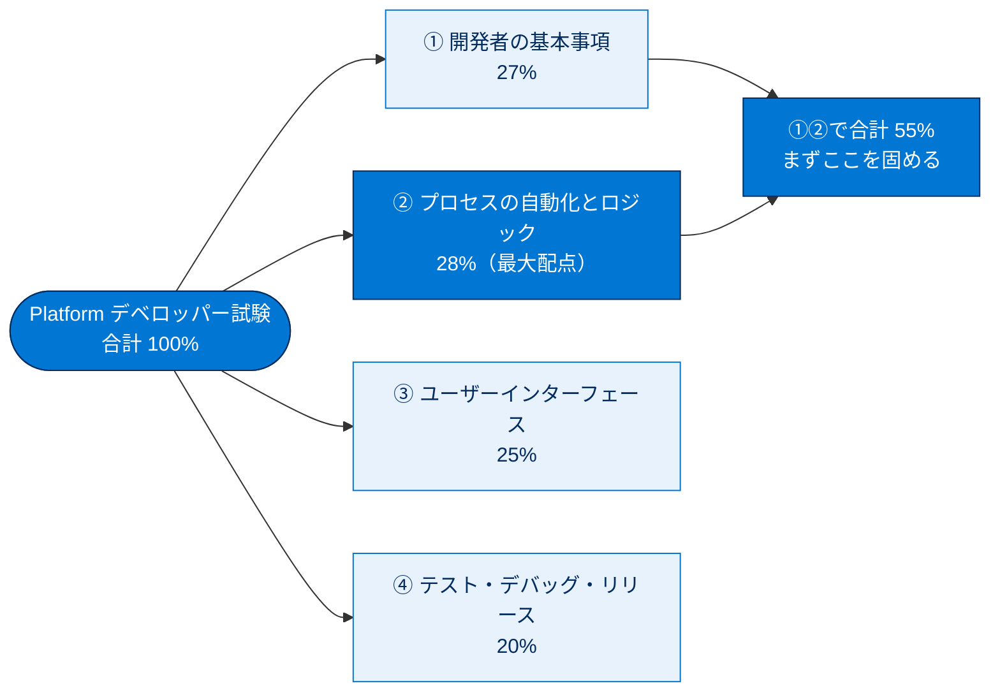
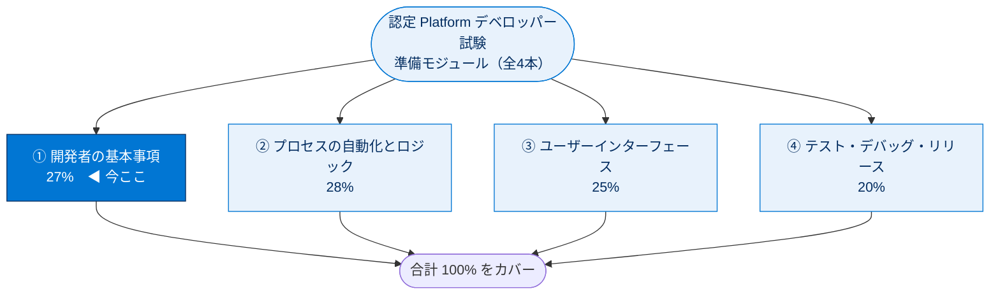
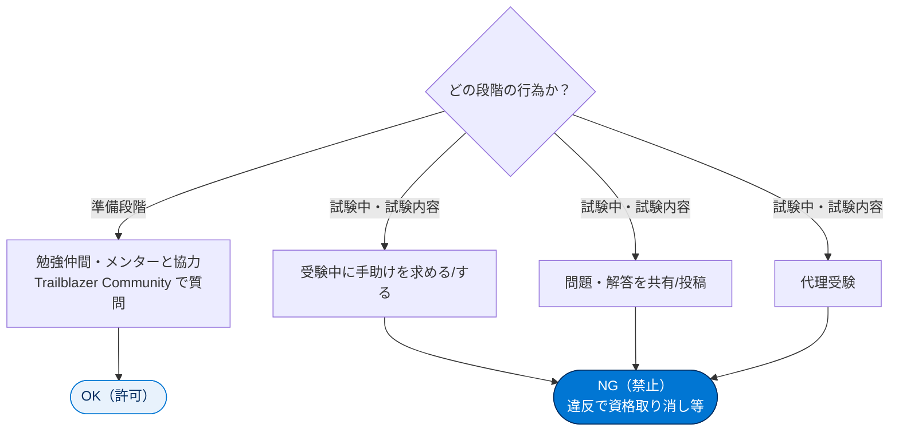

# 認定 Platform デベロッパー資格学習ガイド

## 学習の目的

この単元を完了すると、次のことができるようになります。

- 認定 Platform デベロッパー資格の主なトピック領域について説明する。
- 受験準備のリソースにアクセスする。
- Salesforce ログイン情報のセキュリティを保護するポリシーを説明する。

> [!ポイント] この単元のゴール
>
> 試験直前の復習ユニットの入り口。まず「4セクションの構成と配点」を頭に入れ、配点の高い領域に学習時間を投じる。あわせて受験ポリシー（可否の線引き）と資格更新ルールを確認する。

---

## 認定 Platform デベロッパー資格

Salesforce 認定 Platform デベロッパー資格は、**Lightning Platform** でのビジネスロジック・UI の開発とリリース経験者を対象とする。

> [!用語] Lightning Platform（ライトニングプラットフォーム）
>
> Salesforce のアプリケーション開発基盤（PaaS）。Apex（言語）・SOQL（照会言語）・Lightning コンポーネント（画面部品）などを使い独自アプリを作る土台。旧称「Force.com」。

> [!用語] 宣言型とプログラミング型
>
> **宣言型（Declarative）**＝コードを書かず画面設定で実現（数式項目・入力規則・フロー・積み上げ集計など）。**プログラミング型（Programmatic）**＝Apex 等のコードで実現。試験では「宣言型で足りるか、コードが必要か」の見極めが問われる。

この試験の主なトピックとその配分は以下のとおり。

| セクション | 配点（割合） | 主な内容 |
| --- | --- | --- |
| **開発者の基本事項** | **27%** | マルチテナント、MVC、データモデル、宣言型 vs プログラミング型 |
| **プロセスの自動化とロジック** | **28%** | Apex、SOQL/SOSL/DML、トリガー、フロー、ガバナ制限 |
| **ユーザーインターフェース** | **25%** | Lightning コンポーネント、Visualforce、画面開発 |
| **テスト、デバッグ、リリース** | **20%** | Apex テスト、デバッグログ、デプロイ・リリース管理 |

> [!ポイント] 配点はそのまま暗記する
>
> 配点は試験本体でも問われる。語呂は **27 / 28 / 25 / 20**（合計 100%）。最大配点は「プロセスの自動化とロジック（28%）」。これと「開発者の基本事項（27%）」だけで **55%** を占めるため、まずこの2セクションを固めるのが合格への近道。

---

## 試験の準備

このモジュールを含め、認定取得を目的とするモジュールが全4本ある。

- 開発者の基本事項
- プロセスの自動化とロジック
- ユーザーインターフェース
- テスト、デバッグ、リリース

各モジュールは**シナリオ・対話型フラッシュカード・リソースリンク・主要トピック**で構成される。

> [!用語] Trailblazer Community（トレイルブレイザーコミュニティ）
>
> Salesforce のユーザー・開発者・管理者が集まる公式コミュニティ。質問投稿、勉強仲間募集、グループ参加ができる。**準備段階で他者と協力できる正規の場**（受験ポリシーでも許可）。

---

## 試験の実施要項とポリシー

試験のセキュリティと機密保護は、価値ある認定資格の提供に不可欠。プログラム参加には「**Salesforce 認定資格プログラム同意書**」への同意が必要。受験ポリシーの要点は以下（詳細はヘルプ記事「Salesforce 認定資格プログラム同意書および行動規範」）。

### 推奨事項（やってよいこと）

- **Trailhead の承認済み学習資料**（受験ガイド、Trailmix、Trailhead Academy、Trailhead LIVE など）で準備する。
- コミュニティグループや勉強仲間・メンターと、**Trailblazer Community で協力する**。
- 試験ガイドラインを確認し遵守する。
- 認定資格のセキュリティを損ねる行動を見たら **Credential Security チーム**にケースを送る。

### 禁止される行為（やってはいけないこと）

- 試験の**問題・解答**や **Superbadge のソリューション**を共有・使用・要求する。
- 受験中に**手助けをしたり・してもらったり・求めたり**する。
- 「Salesforce 認定資格プログラム同意書」に違反する行為。

> [!注意] 「協力 OK」と「不正 NG」の線引き
>
> 試験頻出。**準備段階で勉強仲間と協力するのは OK**、**試験の問題・解答の共有や受験中の手助けは NG**。「学習パートナーと準備」は許可、「試験中に手助けを求める／試験内容をコミュニティに投稿／代理受験」は禁止。

> [!例] 許可される活動 / 禁止される活動
>
> | 活動 | 可否 |
> | --- | --- |
> | 学習パートナーと一緒に試験に向けて準備する | OK（許可） |
> | Trailblazer Community で質問や協力をする | OK（許可） |
> | 試験中に手助けを求める | NG（禁止） |
> | 試験の内容（問題・解答）をコミュニティに投稿する | NG（禁止） |
> | 同僚の代わりに試験を受ける（代理受験） | NG（禁止） |

違反時の措置（これらに限定されない）：受験のキャンセル、資格の取得停止・取り消し、プログラムやコミュニティからの除外。

---

## 認定資格を更新する

資格維持には、**1 年に 1 回そのリリース更新モジュールを完了する**必要がある。期日までに完了しないと**資格は失効する**。

> [!ポイント] 資格は「取って終わり」ではない
>
> **年1回の更新（リリース更新モジュール）** が必須。期日までに完了しないと失効するため、取得後も継続的メンテナンスが必要。詳細は「Maintaining Your Salesforce Certification」ページを参照。

---

## 試験対策：押さえておきたいポイント

> [!ポイント] この学習ガイドで必ず覚える3点
>
> 1. **4セクションの配点**：開発者の基本事項 27% / 自動化とロジック 28% / UI 25% / テスト・デバッグ・リリース 20%。
> 2. **受験ポリシー**：準備時の協力は OK、試験問題・解答の共有や受験中の手助けは NG。
> 3. **資格の更新**：年1回のリリース更新モジュールを完了しないと失効する。

> [!まとめ] この単元のまとめ
>
> - 認定 Platform デベロッパー資格は **Lightning Platform** での開発・リリース経験者向け。
> - 試験は **4 セクション（27% / 28% / 25% / 20%）**。
> - 学習は **公式（Trailhead）の承認済み資料**で行い、**Trailblazer Community** での協力は推奨。
> - 試験の**問題・解答の共有や受験中の手助けは禁止**（違反で資格取り消し等）。
> - 資格維持には**年1回の更新モジュール完了**が必要。

---

## リソース

- ヘルプ記事: Salesforce Certification Program Agreement and Code of Conduct（Salesforce 認定資格プログラム規約および行動規範）

---

## テスト（+100 ポイント獲得）

> 完了日: 2026/6/10

**1. 認定試験の準備で他の開発者と協力・質問できる場所はどれですか?**

- Salesforce サポート
- IdeaExchange
- Trailhead ライブ
- **Trailblazer Community**

**2.「Salesforce Certification Program Agreement」で許可されている活動はどれですか?**

- 認定試験の受験中に手助けを求める。
- **学習パートナーと一緒に認定試験に向けて準備する。**
- Trailblazer Community に試験の内容を投稿する。
- 同僚の代わりに認定試験を受ける。

> [!注意] 日本語環境で受講する場合
>
> 本単元は Trailhead の日本語教材の抽出。テスト・リンクは Trailhead 該当モジュール上で操作する。リソースのヘルプ記事は原文（英語名）で検索すると見つけやすい。
