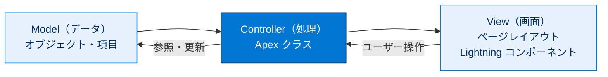
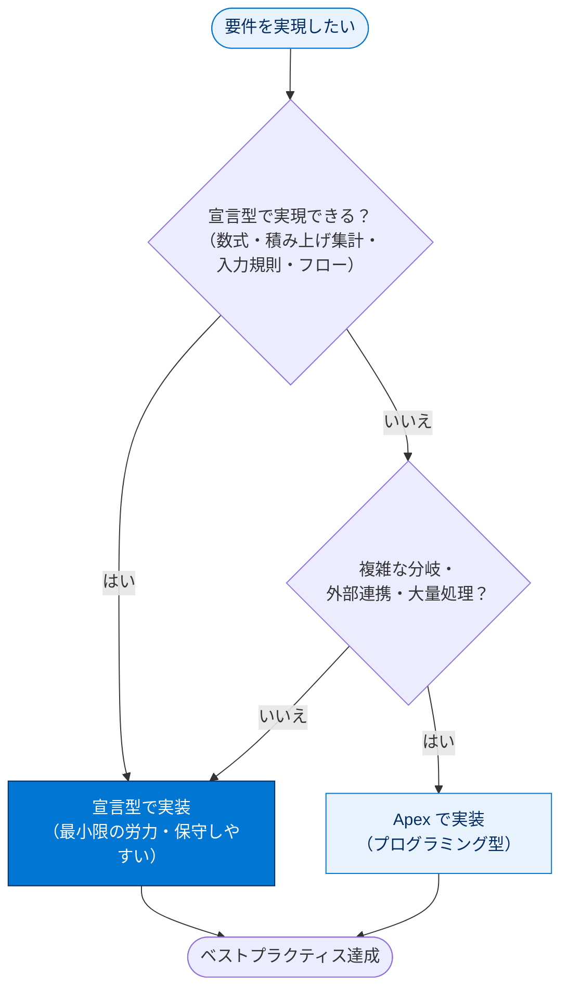

# 開発者の基本事項を確認する

## 学習の目的

この単元を完了すると、次のことができるようになります。

- 試験の「開発者の基本事項」セクションで評価される主なトピックを説明する。
- マルチテナント、MVC アーキテクチャ、データモデルなどの基本概念を確認する。
- 開発者向け Agentforce のユースケースと制限事項を理解する。

> [!ポイント] この単元のゴール
>
> 復習ユニット。「開発者の基本事項（試験の **27%**）」で問われる論点を確認し、練習問題とフラッシュカードで自己診断する。下の3本柱を確実に言えるようにする。

---

## 主なトピック

「開発者の基本事項」セクション（試験の **27%**）で評価されるトピックは以下。

| トピック領域 | 含まれる主な概念 |
| --- | --- |
| **マルチテナントの概念とデザインフレームワーク** | マルチテナント、MVC アーキテクチャ、Lightning コンポーネントフレームワーク |
| **宣言型とプログラミング型のユースケースとベストプラクティス** | ガバナ制限、数式項目、積み上げ集計、宣言 vs コードの使い分け |
| **適切なデータモデルへのアクセス** | オブジェクト、項目、リレーション、外部 ID |
| **開発者向け Agentforce** | Agentforce のユースケースと制限事項 |

> [!用語] マルチテナント（Multitenancy）
>
> 1 つの基盤を**複数の顧客（テナント）で共有**する仕組み。1テナントがリソースを使いすぎて他に迷惑をかけないよう、**ガバナ制限**が設けられている。

> [!用語] MVC アーキテクチャ（Model-View-Controller）
>
> アプリを **Model（データ）／View（画面）／Controller（処理）** の3層に分ける設計。Salesforce では Model=オブジェクト・項目、View=ページレイアウト・Lightning コンポーネント、Controller=Apex クラス と対応する。

> [!用語] ガバナ制限（Governor Limits）
>
> マルチテナント環境で1人のユーザーやコードがリソースを独占しないよう課される**実行上の上限**（例：1 トランザクションあたりの SOQL クエリ数や DML 行数）。試験頻出。

> [!用語] 外部 ID（External ID）
>
> 他システムのレコード ID を Salesforce 側で保持する項目属性。UPSERT 等で内部 ID を知らなくても外部キーでレコードを一意に特定できる。データモデル設計で頻出。

> [!用語] Agentforce（エージェントフォース）
>
> Salesforce の **AI エージェント基盤**。独自アクションやロジックを組み込める。試験ではユースケースと制限事項の理解が問われる。

> [!例] 宣言型とプログラミング型の使い分け（このセクションの肝）
>
> - 「子レコードの金額を親に合計表示」→ まず**積み上げ集計項目（宣言型）** を検討。
> - 「主従関係がなく参照関係のみ」「複雑な分岐や外部連携が必要」→ **Apex（プログラミング型）** を検討。
> - 試験では「最小限の労力（宣言型優先）で要件を満たす選択肢」が問われる。

---

## 練習問題とフラッシュカード（自己診断）

この単元には、実際的なシナリオに基づく**対話型の練習問題**と、主要トピックを復習できる**フラッシュカード**が用意されている。練習問題に解答すると正誤と理由の説明がすぐ表示される。

> [!手順] 練習問題・フラッシュカードの進め方
>
> 1. 練習問題：シナリオを読み、正しい解答をクリック（**複数正解あり**）→ **[Submit]** で正誤と理由を確認。
> 2. フラッシュカード：問題・用語を読み、カードをクリックで正解表示。矢印で前後のカードへ移動。

> [!注意] 採点対象ではない
>
> 自己診断ツールでありバッジ採点には影響しない。理由の説明を読んで理解を深めるのが目的。

> [!ポイント] フラッシュカードは「用語の即答」訓練に最適
>
> マルチテナント・MVC・ガバナ制限・外部 ID・積み上げ集計などを**見た瞬間に意味を言える**状態が理想。詰まる用語を洗い出す。

---

## 関連バッジ

不安が残る領域は、対応する関連バッジで補強する。

| バッジ | コンテンツタイプ |
| --- | --- |
| Agentblazer Champion になる | トレイル |
| プラットフォームイベントの基礎 | モジュール |
| Apex と .NET の基本 | モジュール |
| 数式と入力規則 | モジュール |
| データモデリング | モジュール |
| データ管理 | モジュール |
| 開発者向け Agentforce | モジュール |
| Agentforce DX を使用してエージェントを作成する | プロジェクト |

> [!ポイント] 弱点に応じて補強
>
> データモデル系なら **データモデリング／データ管理**、宣言型の自動化なら **数式と入力規則**、AI エージェントなら **開発者向け Agentforce** が直結する。

---

## 試験対策：押さえておきたいポイント

> [!ポイント] 「開発者の基本事項（27%）」の頻出論点チェックリスト
>
> | 論点 | 押さえる内容 |
> | --- | --- |
> | マルチテナント | なぜガバナ制限が必要か（基盤を全顧客で共有するから） |
> | MVC | Model=オブジェクト／View=画面・Lightning／Controller=Apex |
> | 宣言 vs コード | 宣言型で足りるなら宣言型を優先。コードは複雑要件のとき |
> | 数式項目 / 積み上げ集計 | コードなしで計算・集計できる宣言型機能 |
> | データモデル | オブジェクト・項目・リレーション（参照／主従）・外部 ID |
> | Agentforce | AI エージェントのユースケースと制限事項 |

> [!注意] 「ベストプラクティス＝最小限の労力で要件達成」
>
> 設計問題では、実現手段が複数あっても**もっとも保守しやすく労力の少ない方法（多くは宣言型）** を選ぶのがベストプラクティス。「とりあえず Apex」を選ばない。

> [!まとめ] この単元のまとめ
>
> - 「開発者の基本事項」は試験の **27%**。
> - 主なトピックは **①マルチテナント／MVC ②宣言型 vs プログラミング型 ③データモデル ④Agentforce**。
> - **練習問題とフラッシュカード**で論点を総点検。
> - 設計判断では**宣言型を優先**し、複雑なときだけコードを使う。

---

## テスト（+100 ポイント）

**1. 認定 Platform デベロッパー試験で「開発者の基本事項」セクションが占める割合は何パーセントですか?**

- A. 7%
- B. 15%
- **C. 27%**
- D. 28%

**2. 「開発者の基本事項」セクションで取り上げる主なトピックはどれですか?**

- A. データの設定、管理、分析
- B. CRM のコアオブジェクトと Apex トリガー
- **C. マルチテナント環境と、宣言型とプログラミング型のカスタマイズのベストプラクティス**
- D. 権限、オブジェクトリレーション、開発者ツール

> [!ポイント] 解答のヒント
>
> 設問1は配点の暗記（**27%**）。設問2は選択肢 D も一見もっともらしいが、主題は「マルチテナント＋宣言型/プログラミング型のベストプラクティス」なので C が正解。

> [!注意] 日本語環境で受講する場合
>
> 本単元は Trailhead の日本語教材の抽出。練習問題・フラッシュカード・テストは Trailhead 該当モジュール上で操作する。用語の英語名も英語出題に備えて確認しておくとよい。

---

## 🎓 この単元のまとめ

この単元では、試験の 27% を占める「開発者の基本事項」で問われる土台の概念（マルチテナント／MVC／データモデル／Agentforce）と、設計判断の基本方針「宣言型を優先し、必要なときだけコードを使う」を確認しました。

次の表は、このセクションの4本柱と「試験で問われる最重要ポイント」を凝縮したものです。

| トピック領域 | 押さえる核心 |
| --- | --- |
| マルチテナント | 基盤を全顧客で共有 → だから**ガバナ制限**が必要 |
| MVC | Model=オブジェクト・項目／View=画面・Lightning／Controller=Apex |
| 宣言型 vs プログラミング型 | **宣言型を優先**。複雑要件のときだけ Apex |
| データモデル | オブジェクト・項目・リレーション（参照／主従）・**外部 ID** |
| Agentforce | AI エージェントのユースケースと制限事項 |

> [!まとめ] この単元の要点
>
> - 「開発者の基本事項」は試験の **27%**。土台となる概念を広く問われる。
> - **マルチテナント**だからこそ **ガバナ制限**が存在する、という因果を理解する。
> - **MVC** は Model=オブジェクト・項目／View=画面・Lightning／Controller=Apex に対応。
> - 設計は**宣言型（数式・積み上げ集計・入力規則・フロー）を優先**し、複雑なときだけ Apex。
> - **練習問題とフラッシュカード**で用語の即答力を鍛え、弱点は関連バッジで補強する。

> [!豆知識] 「マルチテナント」はマンション、「ガバナ制限」は管理規約
>
> マルチテナントは1棟のマンション（基盤）を多数の住人（顧客）で共有するイメージです。1人が大音量を出すと全員が困るため、「夜は静かに」といった管理規約（ガバナ制限）が必要になります。なぜ Salesforce にガバナ制限があるのかを問われたら、この「共有しているから」という一点に立ち返れば確実に答えられます。
