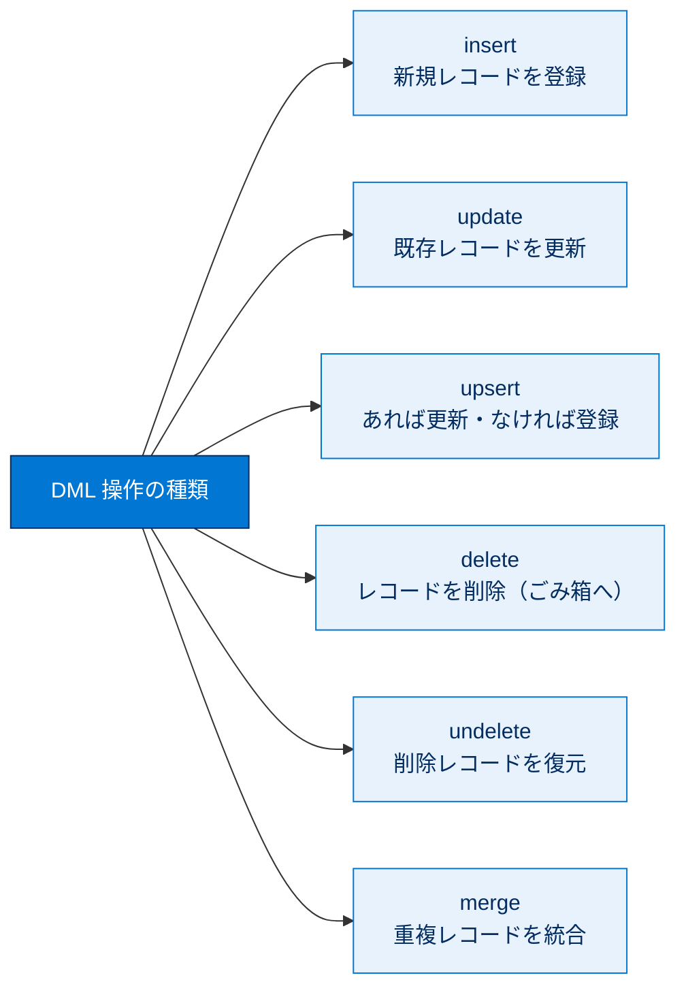
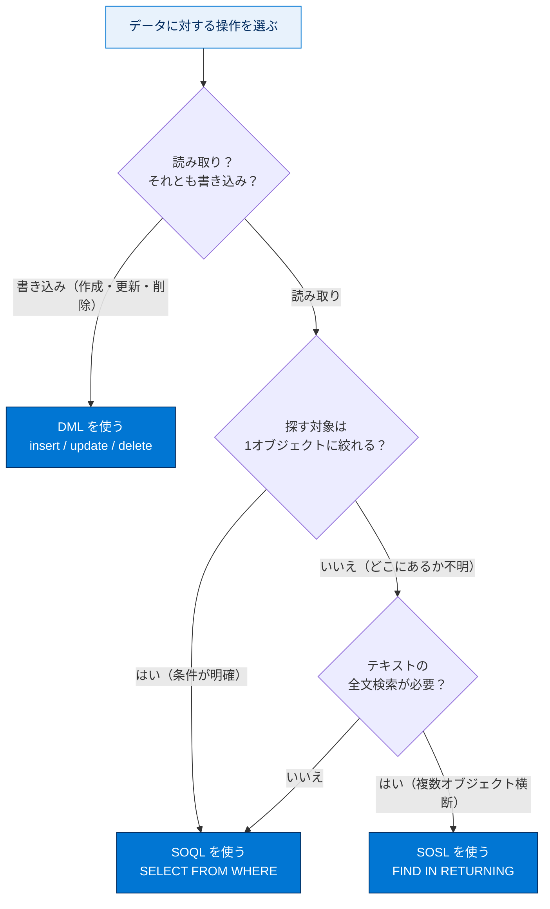
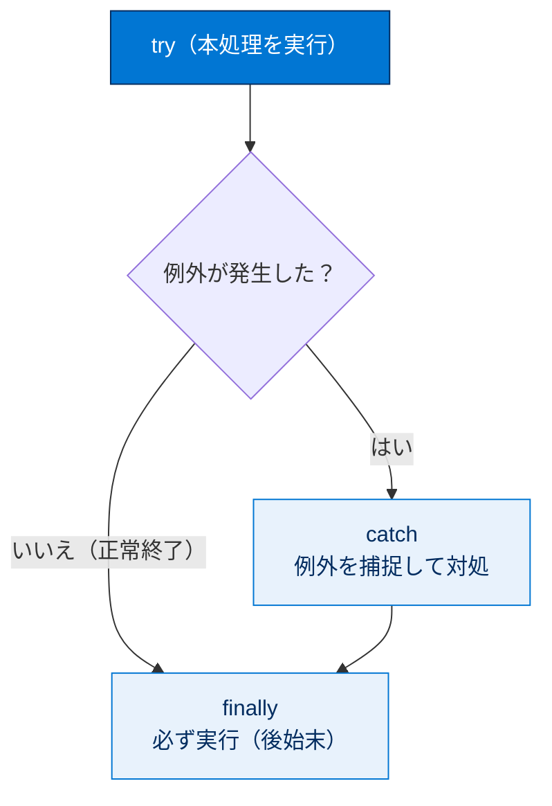

# SOQL、SOSL、DML の復習

## 学習の目的

この単元を完了すると、次のことができるようになります。

- Apex で SOSL、SOQL、DML ステートメントを記述し、結果を評価する。
- ガバナ制限と、その Apex トランザクションへの影響を理解する。
- Apex でカスタム例外などの例外処理を実行する。

> [!ポイント] この単元のゴール
>
> 復習ユニット。Apex でデータを扱う3本柱 **SOQL（照会）・SOSL（検索）・DML（更新）** の違いと、付随する **ガバナ制限**・**例外処理** を整理する。「プロセスの自動化とロジック（28%）」の中核。

---

## 主なトピック

この単元で確認するトピックは SOQL / SOSL / DML / 例外とガバナ制限。

> [!用語] SOQL（Salesforce Object Query Language／ソークル）
>
> Salesforce のデータを**照会（読み取り）** する言語。SQL に似て `SELECT ... FROM ... WHERE ...` で**特定の1オブジェクト（と関連）** からレコードを取得する。

> [!用語] SOSL（Salesforce Object Search Language／ソッスル）
>
> **複数オブジェクトをまたぐテキスト全文検索**の言語。`FIND '検索語' IN ... RETURNING ...` で取引先・取引先責任者・リードなどを一気にキーワード検索する。

> [!用語] DML（Data Manipulation Language／データ操作言語）
>
> レコードを**作成・更新・削除・復元**する操作。Apex では `insert` / `update` / `upsert` / `delete` / `undelete` / `merge`。SOQL/SOSL が「読み取り」なのに対し DML は「書き込み」。



```sql
-- SOQL：取引先を照会する（読み取り）
SELECT Id, Name, AnnualRevenue
FROM Account
WHERE AnnualRevenue > 1000000
```

```sql
-- SOSL：複数オブジェクトをまたいで 'Acme' を全文検索する
FIND 'Acme' IN ALL FIELDS
RETURNING Account(Id, Name), Contact(Id, LastName)
```

```apex
// DML：取引先を1件作成する（書き込み）
Account acc = new Account(Name = 'Acme Corp');
insert acc;   // insert ステートメントでレコードを登録
```

> [!例] SOQL と SOSL の使い分け
>
> - 「条件が明確な特定の取引先を取得」→ **SOQL**。
> - 「どのオブジェクトのどの項目にあるか不明な文字列を横断検索」→ **SOSL**。
> - 試験では「**全文検索／複数オブジェクト横断なら SOSL**」「**1オブジェクトの条件指定なら SOQL**」の見分けが頻出。



| 比較項目 | SOQL | SOSL | DML |
| --- | --- | --- | --- |
| 役割 | レコードの照会（読み取り） | テキストの全文検索（読み取り） | レコードの作成・更新・削除（書き込み） |
| 対象 | 主に1オブジェクト（関連も可） | 複数オブジェクト横断 | 1つ以上のレコード |
| キーワード | `SELECT ... FROM ... WHERE` | `FIND ... IN ... RETURNING` | `insert/update/upsert/delete/...` |

> [!用語] ガバナ制限（Governor Limits）
>
> 1トランザクションがリソースを独占しないよう課される**実行上の上限**。代表例：**SOQL クエリは 100 回、DML ステートメントは 150 回まで**。超えると実行時例外で停止する。

> [!ポイント] バルク化（Bulkification）＝ループ内で SOQL/DML をしない
>
> ガバナ制限対策の最重要パターン。**for ループの中で SOQL や DML を実行してはいけない**。ループ外でまとめて1回のクエリ／DML にする「バルク化」が必須。試験頻出のベストプラクティス。

```apex
// 悪い例：ループ内で DML（ガバナ制限に抵触しやすい）
for (Account acc : accounts) {
    update acc;   // 件数分だけ DML が走る（NG）
}

// 良い例：ループ外でまとめて1回の DML（バルク化）
List<Account> toUpdate = new List<Account>();
for (Account acc : accounts) {
    acc.Rating = 'Hot';
    toUpdate.add(acc);   // リストに溜める
}
update toUpdate;         // DML は1回だけ（OK）
```

> [!用語] 例外処理（Exception Handling）とカスタム例外
>
> - **例外処理**：エラー発生時にプログラムを止めず対処する仕組み。Apex では **`try / catch / finally`** で囲む。
> - **カスタム例外**：業務固有のエラーを表す自作例外。`Exception` を継承して定義し `throw` で発生させる。

```apex
// カスタム例外の定義と try/catch での処理
public class InventoryException extends Exception {}

try {
    Integer stock = 0;
    if (stock <= 0) {
        throw new InventoryException('在庫がありません');   // 業務固有の異常を投げる
    }
} catch (InventoryException e) {
    System.debug('エラー: ' + e.getMessage());              // 例外を捕捉
} finally {
    System.debug('処理を終了します');                       // 成否に関わらず必ず実行
}
```



---

## 練習問題とフラッシュカード（自己診断）

実際的なシナリオに基づく対話型の練習問題と、**SOQL・SOSL・例外・ガバナ制限**を扱うフラッシュカードが用意されている（**採点対象ではない**）。

> [!手順] 練習問題・フラッシュカードの進め方
>
> 1. 練習問題：シナリオを読み解答をクリック（複数正解あり）→ **[Submit]** で正誤と理由を確認。説明が長ければ **[Expand]**。
> 2. フラッシュカード：問題・用語を読み、カードをクリックで正解表示。矢印で前後へ移動。

---

## 関連バッジ

| バッジ | コンテンツタイプ |
| --- | --- |
| データベースと .NET の基本 | モジュール |
| 検索ソリューションの基礎 | モジュール |
| 非同期 Apex | モジュール |

> [!ポイント] バッジで弱点を補強
>
> SOQL/DML が弱いなら **データベースと .NET の基本**、SOSL（検索）なら **検索ソリューションの基礎**、ガバナ制限対策（大量データ）なら **非同期 Apex**。

---

## 試験対策：押さえておきたいポイント

> [!ポイント] よく出る主要ガバナ制限（同期トランザクション）
>
> | 項目 | 上限 |
> | --- | --- |
> | SOQL クエリの発行回数 | 100 回 |
> | SOQL で取得できる総レコード数 | 50,000 件 |
> | DML ステートメントの発行回数 | 150 回 |
> | DML で処理できる総レコード数 | 10,000 件 |
> | SOSL クエリの発行回数 | 20 回 |
>
> ※同期処理の代表値。正確な最新値は公式「Apex 開発者ガイド／実行ガバナと制限」で確認。

> [!注意] よくある落とし穴
>
> - **ループ内 SOQL/DML**：件数増で即ガバナ制限に抵触。必ずバルク化する。
> - **SOQL と SOSL の取り違え**：横断・全文検索＝SOSL、条件指定の単一オブジェクト＝SOQL。
> - **例外の握りつぶし**：catch で何もしないとバグを見逃す。最低限ログ出力やエラー処理を入れる。

> [!まとめ] この単元のまとめ
>
> - **SOQL=照会／SOSL=全文検索／DML=書き込み** の役割を区別する。
> - **ガバナ制限**を意識し、**ループ内 SOQL/DML を避ける（バルク化）**。
> - エラーは **try/catch/finally** と必要に応じた**カスタム例外**で処理する。

---

## テスト（+100 ポイント）

**1. SOQL、SOSL、DML トピックの準備に役立つ Trailhead モジュールはどれですか?**

- **A. 検索ソリューションの基礎**
- B. 数式と入力規則
- C. Apex メタデータ API
- D. アプリケーションライフサイクルと開発モデル

**2. 「プロセスの自動化とロジック」セクションの主なトピックはどれですか?**

- A. デバッグ手法
- B. コントローラー拡張
- C. セキュリティの脆弱性
- **D. ガバナ制限による影響**

> [!ポイント] 解答のヒント
>
> 設問1：SOQL/SOSL/DML はデータ操作・検索のトピックなので **A（検索ソリューションの基礎）**。設問2：デバッグ・セキュリティは別セクション、コントローラー拡張は UI 寄りなので **D（ガバナ制限による影響）** が正解。

> [!注意] 日本語環境で受講する場合
>
> 本単元は Trailhead の日本語教材の抽出。練習問題・フラッシュカード・テストは Trailhead 該当モジュール上で操作する。用語の英語名も英語出題に備えて確認しておくとよい。
