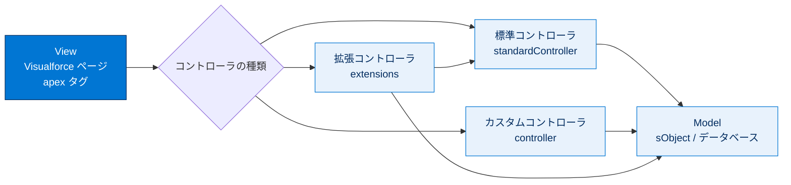
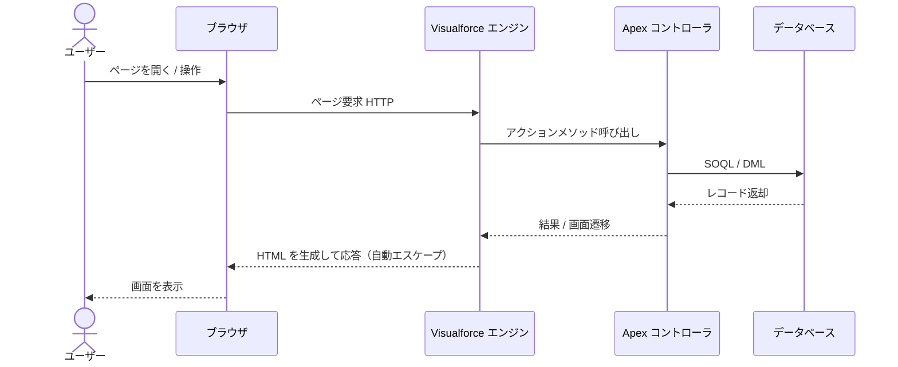
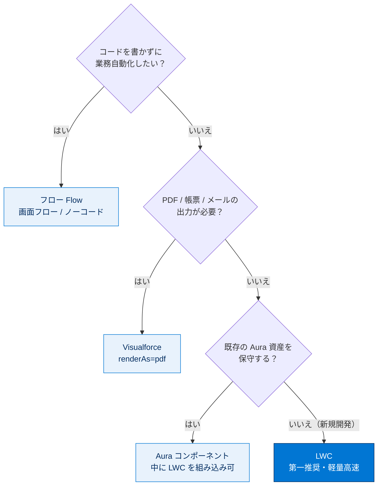

# Visualforce の学習

## 学習の目的

この単元を完了すると、次のことができるようになります。

- ユーザーインターフェースとデータアクセスのセキュリティの脆弱性を防止する。
- Lightning コンポーネント、フロー、Visualforce などカスタム UI コンポーネントを表示して使用する。

> [!ポイント] この単元のゴール
>
> 試験直前の復習単元。「ユーザーインターフェース」セクション（試験の **25%**）で問われる論点を総ざらいする。中心は **Visualforce / Lightning コンポーネント / フロー** の使い分けと、**UI 層・データアクセス層のセキュリティ脆弱性（XSS / SOQL インジェクション / 共有違反など）の防止**。

---

## 主なトピック

「ユーザーインターフェース」セクション（試験の **25%**）は2単元構成。この単元で扱うのは UI・データアクセスのセキュリティ脆弱性と、カスタム UI コンポーネント（LWC / Aura / Visualforce / フロー）。実際的なシナリオに基づく対話型の練習問題が用意されている。

> [!用語] ユーザーインターフェース（UI：User Interface）
>
> ユーザーが画面上で操作する部分。Salesforce では UI を作る方法が複数あり用途で使い分ける。試験では「このシナリオでどの UI 技術が最適か」が頻出。

### ユーザーインターフェース技術の早見表

「**いつどれを使うか**」が頻出論点。

| 技術 | 種類 | 主な用途・特徴 | 適した場面 |
| --- | --- | --- | --- |
| **Lightning Web コンポーネント（LWC）** | クライアントサイド（JavaScript） | Web 標準ベースで高速・軽量。最新の推奨フレームワーク | 新規開発・モダンな UI 全般 |
| **Aura コンポーネント** | クライアントサイド（JavaScript） | LWC より古い独自フレームワーク。LWC と共存可 | 既存 Aura の保守 |
| **Visualforce** | サーバーサイド（マークアップ＋Apex） | ページ全体を Apex コントローラで制御。PDF/帳票に強い | 既存 VF の保守・帳票・メール |
| **フロー（Flow）** | 宣言的（ノーコード） | コードなしで画面・ロジック作成 | 管理者主導の業務自動化・画面フロー |

> [!用語] Visualforce / LWC
>
> - **Visualforce**：独自マークアップタグ（`<apex:...>`）と **Apex コントローラ**を組み合わせる従来型 UI。サーバーサイドでページを組み立てる。PDF/帳票で今も現役。
> - **LWC**：HTML・JavaScript・CSS の Web 標準をベースにした最新 UI フレームワーク。**軽量・高速**で、新規開発の第一推奨。

Visualforce は **MVC（Model-View-Controller）** に沿っており、View（VF ページ）とロジック（コントローラ）が分離される。コントローラには3種類があり、用途で使い分ける。

Visualforce は **サーバーサイド**でページを組み立てる。要求からレンダリングまでの一連のやり取りは次の通り。

> [!例] どの UI 技術を選ぶ？
>
> - 「最新の推奨フレームワークで再利用可能な UI 部品」→ LWC
> - 「請求書を PDF で出力」→ Visualforce（`renderAs="pdf"`）
> - 「コードなしで承認画面」→ 画面フロー（Screen Flow）
> - 「既存 Aura を保守しつつ新機能」→ Aura に LWC を組み込む

「いつどれを使うか」の判断は次のフローで整理できる（試験頻出）。

---

## ユーザーインターフェースのセキュリティ脆弱性

UI 層・データアクセス層では、外部入力をそのまま信用すると重大な脆弱性につながる。

> [!用語] XSS / SOQL インジェクション
>
> - **XSS（クロスサイトスクリプティング）**：入力中の悪意あるスクリプトがエスケープされず画面に出力・実行される攻撃。Visualforce は標準で自動エスケープするが、`escape="false"` で無効化すると危険。
> - **SOQL インジェクション**：入力を文字列連結で SOQL に埋め込むとクエリを改ざんされる脆弱性。**バインド変数（`:変数`）** や `String.escapeSingleQuotes()` で防ぐ。

> [!用語] CRUD / FLS（オブジェクト権限・項目レベルセキュリティ）
>
> **CRUD** はオブジェクト単位の作成・参照・更新・削除権限、**FLS（Field-Level Security）** は項目単位の参照・編集権限。Apex は既定でこれらを無視する（システムモード）ため、UI 用処理では明示的に権限チェックする。

> [!ポイント] UI / データアクセスのセキュリティ対策（頻出）
>
> | 脆弱性 | 主な対策 |
> | --- | --- |
> | **XSS** | 出力を自動エスケープ（Visualforce は既定で有効）。`escape="false"` を安易に使わない |
> | **SOQL/SOSL インジェクション** | 動的 SOQL では**バインド変数 `:var`**。やむを得ず連結する場合は `String.escapeSingleQuotes()` |
> | **共有違反（データの見えすぎ）** | Apex クラスに **`with sharing`** を指定し共有設定を尊重 |
> | **CRUD / FLS の無視** | `isAccessible()` / `isUpdateable()` 等で権限確認、または `WITH SECURITY_ENFORCED` / `Security.stripInaccessible()` |

> [!注意] Apex のデフォルトは「権限を無視する」
>
> Apex は既定で**システムモード**で動作し、実行ユーザーの共有・CRUD・FLS を無視する。UI からユーザーが操作する処理では `with sharing` や `WITH SECURITY_ENFORCED` で**明示的に権限を尊重させる**必要がある。試験頻出の落とし穴。

---

## 練習問題とフラッシュカード（自己診断）

各単元に対話型の練習問題とフラッシュカードがある（**採点対象ではない**）。

> [!手順] 練習問題・フラッシュカードの進め方
>
> 1. 練習問題：シナリオを読み解答をクリック（複数正解あり）→ **[Submit]** で正誤と理由を確認。
> 2. フラッシュカード：問題・用語を読み、カードをクリックで正解表示。矢印で前後へ移動。

---

## 関連バッジ

| バッジ | コンテンツタイプ |
| --- | --- |
| **Visualforce の基礎** | モジュール |
| **Lightning Web コンポーネントの基本** | モジュール |

> [!例] 苦手分野はバッジで補強
>
> Visualforce のタグ・コントローラに自信がなければ「**Visualforce の基礎**」、LWC の基礎が曖昧なら「**Lightning Web コンポーネントの基本**」。

---

## リソース

- ヘルプ記事：Salesforce Certification Program Agreement and Code of Conduct（Salesforce 認定資格プログラム規約および行動規範）

---

## 試験対策：押さえておきたいポイント

> [!ポイント] 「ユーザーインターフェース」セクションの重要数値と観点
>
> - セクションは試験全体の **25%**（正確に暗記）。**2 単元**（Visualforce / Lightning コンポーネントフレームワーク）で構成。
> - **新規開発の第一選択は LWC**（Salesforce 推奨）。
> - **PDF/帳票出力**なら Visualforce（`renderAs="pdf"`）、**ノーコードで業務自動化**ならフロー。
> - LWC と Aura は同一ページで共存可だが、**Aura の中に LWC は入れられても、逆は基本的に不可**。

> [!まとめ] この単元の要点
>
> - 「ユーザーインターフェース」セクションは試験の **25%**。
> - カスタム UI 技術は **LWC / Aura / Visualforce / フロー** の4系統。用途で使い分ける。
> - UI・データアクセス層の脆弱性（**XSS / SOQL インジェクション / 共有・CRUD・FLS の無視**）と標準的な防止策を押さえる。

---

## テスト（+100 ポイント）

### 問題 1

「ユーザーインターフェース」セクションが占める割合は何パーセントですか？

- A. 10%
- B. 15%
- C. 25%
- D. 20%

### 問題 2

Visualforce を使用してカスタムインターフェースを作成するのに役立つ Trailhead モジュールはどれですか？

- A. クイックスタート: Visualforce を知る
- B. Visualforce の基礎
- C. Visualforce 開発 101
- D. Visualforce の基本概念

> [!注意] 日本語環境で受講する場合
>
> 本単元は Trailhead の日本語教材の抽出。練習問題・フラッシュカード・テストは Trailhead 該当モジュール上で操作する。用語の英語名も英語出題に備えて確認しておくとよい。

---

## 🎓 この単元のまとめ

この単元では、「ユーザーインターフェース（25%）」セクションの前半として、UI 技術4系統（LWC / Aura / Visualforce / フロー）の使い分けと、UI・データアクセス層のセキュリティ脆弱性（XSS / SOQL インジェクション / 共有・CRUD・FLS の無視）の防止策を確認しました。

次の図は、「いつどの UI 技術を選ぶか」という頻出論点を1枚に総括したものです。

> [!まとめ] この単元の要点
>
> - 「ユーザーインターフェース」セクションは試験の **25%**、2 単元構成。
> - UI 技術は **LWC / Aura / Visualforce / フロー** の4系統。**新規開発の第一選択は LWC**。
> - **PDF・帳票**は Visualforce（`renderAs="pdf"`）、**ノーコード自動化**はフロー。
> - 脆弱性対策：**XSS**＝自動エスケープを無効化しない、**SOQL インジェクション**＝バインド変数 `:var`。
> - Apex は既定で**システムモード**（権限無視）。UI 経由は **`with sharing` ＋ `WITH SECURITY_ENFORCED`** で権限を尊重させる。

> [!豆知識] Apex は「デフォルトで権限を見ない」言語
>
> 多くの開発者が驚くのが、Apex が既定で**実行ユーザーの共有設定・CRUD・FLS を無視する（システムモードで動く）**ことです。つまり「画面に出していない他人のレコードまで読めてしまう」状態が初期値です。だからこそ UI からユーザーが触る処理では `with sharing` や `WITH SECURITY_ENFORCED` を明示する必要があり、これを忘れる「権限の見えすぎ」が試験でもセキュリティ問題として狙われます。
