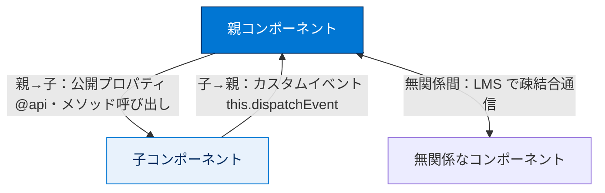
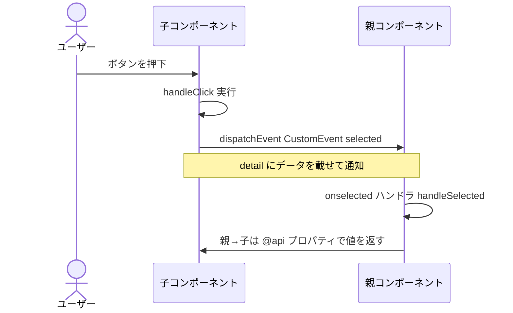
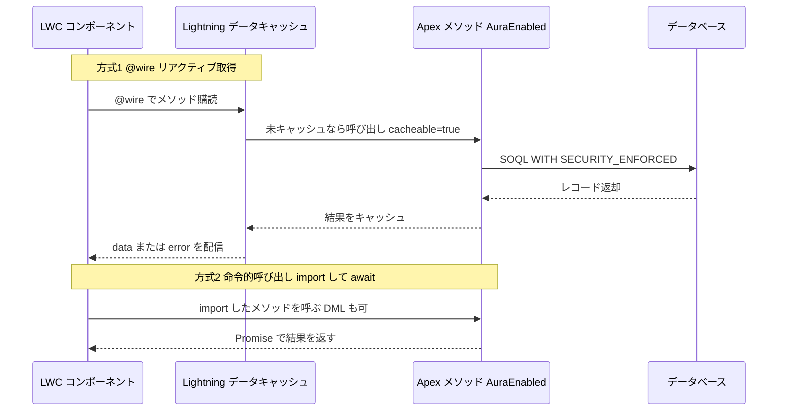

# Lightning コンポーネントフレームワークの確認

## 学習の目的

この単元を完了すると、次のことができるようになります。

- LWC のフレームワーク、メリット、イベントなど、ユースケースとベストプラクティスを説明する。
- LWC、フロー、Agentforce など各種ページコンポーネントと連携する Apex を実装する。

> [!ポイント] この単元のゴール
>
> 「ユーザーインターフェース」セクション（試験の **25%**）の2つめの復習単元。中心は **LWC のフレームワーク・メリット・イベント**と、**各種ページコンポーネント（LWC / フロー / Agentforce）と連携する Apex の実装**。「いつ何を使い、どう Apex とつなぐか」を整理する。

---

## Lightning コンポーネントフレームワークの全体像

> [!用語] Lightning コンポーネントフレームワーク
>
> 再利用可能な UI 部品を作る仕組みの総称。現在は **LWC（Lightning Web Components）** と、それ以前の **Aura コンポーネント**の2系統。新規開発では LWC が推奨。

### LWC と Aura の比較

| 比較項目 | LWC | Aura コンポーネント |
| --- | --- | --- |
| ベース技術 | **Web 標準**（HTML/JS/CSS、ES6+） | Salesforce 独自フレームワーク |
| パフォーマンス | **軽量・高速**（ブラウザネイティブ） | LWC より重い |
| 推奨度 | **新規開発の第一選択** | 既存資産の保守が中心 |
| 共存 | Aura の中に LWC を**入れられる** | LWC の中に Aura は基本入れられない |
| ファイル構成 | `.html` / `.js` / `.js-meta.xml` ほか | `.cmp` / コントローラ / ヘルパーほか |

> [!ポイント] LWC のメリット（試験頻出）
>
> - **Web 標準ベース**で将来性が高い。
> - **軽量で高速**（独自レイヤが薄くブラウザ機能を直接利用）。
> - **再利用性とカプセル化**が高く、コンポーネント単位で開発・テスト可能。
> - Salesforce の**公式推奨**フレームワーク。

---

## LWC のイベント（コンポーネント間通信）

> [!用語] LWC のイベント（Events）
>
> コンポーネント間で情報をやり取りする仕組み。**親子の方向**で手段が変わる。子→親は**カスタムイベント**、親→子は**公開プロパティ（@api）やメソッド呼び出し**が基本。



> [!ポイント] イベントの方向を覚える
>
> - **子 → 親**：`this.dispatchEvent(new CustomEvent('名前', {...}))` を発行し、親が `on名前` でハンドル。
> - **親 → 子**：子の **`@api`** で公開したプロパティに値を渡す／公開メソッドを呼ぶ。
> - **無関係なコンポーネント間**：**Lightning Message Service（LMS）** で通信する。

**具体例：カスタムイベントの最小例（子がボタン押下を親に伝える）**

```javascript
// 子コンポーネントの JavaScript
import { LightningElement } from 'lwc';

export default class ChildButton extends LightningElement {
    handleClick() {
        // 'selected' カスタムイベントを発行し親へ通知
        const evt = new CustomEvent('selected', {
            detail: { id: 123 } // 親へ渡すデータ
        });
        this.dispatchEvent(evt);
    }
}
```

```html
<!-- 親コンポーネントのテンプレート：on + イベント名 でハンドル -->
<template>
    <c-child-button onselected={handleSelected}></c-child-button>
</template>
```

**カスタムイベントの伝播（子→親）の流れ**



---

## ページコンポーネントと連携する Apex

LWC やフローからサーバー側のデータ・処理を呼ぶには Apex を実装する。連携先ごとに必要な「お作法」が異なる。

> [!用語] Apex（エイペックス）
>
> Salesforce のサーバーサイド言語。LWC・フロー・Agentforce などの UI から、Apex メソッドを呼んでデータ取得や更新を行う。

### 連携先別：Apex メソッドの公開方法

| 連携先 | Apex 側で必要な指定 | ポイント |
| --- | --- | --- |
| **LWC（ワイヤ／命令的呼び出し）** | `@AuraEnabled`（読み取りは `cacheable=true`） | `@wire` でデータ取得、または命令的に `import` して呼ぶ |
| **フロー（Flow）** | `@InvocableMethod` | 入出力は `@InvocableVariable`。バルク（List）対応が前提 |
| **Agentforce / エージェント** | `@InvocableMethod` ＋ 説明（description） | エージェントが呼べるアクションとして公開 |

> [!例] LWC から呼べる Apex メソッド
>
> `@AuraEnabled` で LWC から呼び出せる。読み取り専用なら `cacheable=true` でキャッシュが効く。

```apex
public with sharing class AccountController {
    // cacheable=true：読み取り専用。@wire でキャッシュ利用可
    @AuraEnabled(cacheable=true)
    public static List<Account> getAccounts() {
        // with sharing なので実行ユーザーの共有設定を尊重
        return [SELECT Id, Name FROM Account WITH SECURITY_ENFORCED LIMIT 10];
    }
}
```

> [!例] フローから呼べる Apex メソッド
>
> `@InvocableMethod` でフロービルダーの「アクション」として呼び出せる。

```apex
public with sharing class GreetingAction {
    // フローから呼び出せる Invocable メソッド
    @InvocableMethod(label='挨拶を生成' description='名前から挨拶文を返す')
    public static List<String> makeGreeting(List<String> names) {
        // フローはバルク実行されるため入出力は必ず List で扱う
        List<String> results = new List<String>();
        for (String n : names) {
            results.add('こんにちは、' + n + ' さん');
        }
        return results;
    }
}
```

**LWC から Apex を呼ぶ2方式（@wire と命令的呼び出し）**



> [!ポイント] Apex 連携で問われる勘所
>
> - LWC から呼ぶメソッドは **`@AuraEnabled`** 必須。読み取り専用は **`cacheable=true`**（付けると DML 不可）。
> - フロー / Agentforce から呼ぶメソッドは **`@InvocableMethod`**。引数・戻り値は **List（バルク対応）** が原則。
> - UI 経由の処理では **`with sharing`** ＋ **`WITH SECURITY_ENFORCED`**（または `Security.stripInaccessible()`）がベストプラクティス。

> [!注意] cacheable=true の落とし穴
>
> `@AuraEnabled(cacheable=true)` を付けたメソッドは**読み取り専用**扱いで、内部で **DML を実行できない**。更新処理には `cacheable=true` を付けない。

---

## 練習問題とフラッシュカード（自己診断）

対話型の練習問題とフラッシュカードがある（**採点対象ではない**）。

> [!手順] 練習問題・フラッシュカードの進め方
>
> 1. 練習問題：シナリオを読み解答をクリック（複数正解あり）→ **[Submit]** で正誤と理由を確認。
> 2. フラッシュカード：問題・用語を読み、カードをクリックで正解表示。矢印で前後へ移動。

---

## 関連バッジ

| バッジ | コンテンツタイプ |
| --- | --- |
| **Lightning Web コンポーネントでのベストプラクティス** | モジュール |
| **Visualforce と Lightning Experience** | モジュール |
| **クイックスタート: Aura コンポーネント** | プロジェクト |
| **Aura 開発者向け Lightning Web コンポーネント** | モジュール |
| **セキュアなサーバーサイド開発** | モジュール |
| **Apex を使用したエージェントのカスタマイズ** | モジュール |

> [!例] 目的別おすすめバッジ
>
> - LWC の作法・パフォーマンス → 「**Lightning Web コンポーネントでのベストプラクティス**」
> - Aura から LWC へ移行 → 「**Aura 開発者向け Lightning Web コンポーネント**」
> - サーバーサイドのセキュリティ → 「**セキュアなサーバーサイド開発**」
> - Agentforce 連携 → 「**Apex を使用したエージェントのカスタマイズ**」

---

## リソース

- ヘルプ記事：Apex および Visualforce 開発のセキュリティガイドライン
- ヘルプ記事：Apex からのフローの起動
- Lightning Web コンポーネント開発者ガイド：lightning__FlowScreen Target

---

## 試験対策：押さえておきたいポイント

> [!ポイント] LWC の重要キーワード総まとめ
>
> | キーワード | 意味・役割 |
> | --- | --- |
> | **`@api`** | プロパティ／メソッドを**公開**し、親から値を渡せるようにする |
> | **`@track`** | オブジェクト/配列の内部変更追跡用（プリミティブは不要） |
> | **`@wire`** | Apex メソッドや UI API から**リアクティブにデータ取得** |
> | **`CustomEvent`** | **子 → 親**へのイベント通知 |
> | **`@AuraEnabled`** | Apex メソッドを LWC/Aura から**呼び出し可能**にする |
> | **`@InvocableMethod`** | Apex メソッドを**フロー / Agentforce**から呼び出し可能にする |
> | **LMS** | 関連のないコンポーネント間の**疎結合通信**（Lightning Message Service） |

> [!注意] 「フローは必ずバルクで動く」を忘れない
>
> フローや `@InvocableMethod` はレコードを**一括（バルク）**で処理する前提。引数・戻り値が **List** なのはこのため。ループ内でクエリ/DML を書くとガバナ制限に抵触する。

> [!まとめ] この単元の要点
>
> - 新規開発の第一選択は **LWC**（Web 標準ベースで軽量・高速・推奨）。
> - イベント通信は **子→親はカスタムイベント、親→子は @api**。無関係間は **LMS**。
> - Apex 連携：**LWC は `@AuraEnabled`（読み取りは `cacheable=true`）／フロー・Agentforce は `@InvocableMethod`（List で受け渡し）**。
> - セキュリティは **`with sharing` ＋ `WITH SECURITY_ENFORCED`** が基本。

---

## テスト（+100 ポイント）

### 問題 1

「ユーザーインターフェース」セクションの準備に役立つ Trailhead モジュールはどれですか？

- A. 非同期 Apex
- B. ユーザー認証
- C. Lightning Web コンポーネントでのベストプラクティス
- D. Lightning フロー

### 問題 2

「ユーザーインターフェース」セクションの準備として達成すべき学習の目的はどれですか？

- A. 数式項目の機能とユースケースについて説明する。
- B. トリガーを使用する状況を説明する。
- C. LWC のフレームワーク、メリット、イベントなど、ユースケースとベストプラクティスについて説明する。
- D. 実行順序の影響を説明する。

> [!注意] 日本語環境で受講する場合
>
> 本単元は Trailhead の日本語教材の抽出。練習問題・フラッシュカード・テストは Trailhead 該当モジュール上で操作する。用語の英語名も英語出題に備えて確認しておくとよい。

---

## 🎓 この単元のまとめ

この単元では、「ユーザーインターフェース（25%）」セクションの後半として、LWC のメリット・イベント通信の方向、そして各種ページコンポーネント（LWC / フロー / Agentforce）と連携する Apex の公開方法を確認しました。

次の表は、LWC のイベント方向と Apex 連携の作法を凝縮した早見表です。

| 場面 | 手段・アノテーション | 要点 |
| --- | --- | --- |
| 子 → 親 | `CustomEvent`（`dispatchEvent`） | 親は `on名前` でハンドル |
| 親 → 子 | `@api` プロパティ／公開メソッド | 親から値を渡す |
| 無関係なコンポーネント間 | **LMS**（Lightning Message Service） | 疎結合通信 |
| LWC から Apex | `@AuraEnabled`（読み取りは `cacheable=true`） | `cacheable=true` は DML 不可 |
| フロー / Agentforce から Apex | `@InvocableMethod` | 入出力は **List**（バルク前提） |

> [!まとめ] この単元の要点
>
> - 新規開発の第一選択は **LWC**（Web 標準ベースで軽量・高速・公式推奨）。
> - イベントは **子→親はカスタムイベント、親→子は `@api`**、**無関係間は LMS**。
> - LWC から呼ぶ Apex は **`@AuraEnabled`**、読み取り専用は **`cacheable=true`**（付けると DML 不可）。
> - フロー / Agentforce から呼ぶ Apex は **`@InvocableMethod`**。引数・戻り値は **List（バルク対応）**。
> - セキュリティは **`with sharing` ＋ `WITH SECURITY_ENFORCED`** が基本。

> [!豆知識] フローが「List」を要求するのはバルクで動くから
>
> `@InvocableMethod` の引数・戻り値が必ず `List` なのは、フローが**レコードをまとめて（バルクで）処理する前提**だからです。1件ずつ呼ぶように見えても、内部では複数件をまとめて1回呼び出します。だから Apex 側でループ内クエリを書くとガバナ制限に抵触します。「フローは必ずバルクで動く」というこの1点を押さえると、なぜ List なのか・なぜバルク化が必要かが一本の線でつながります。
