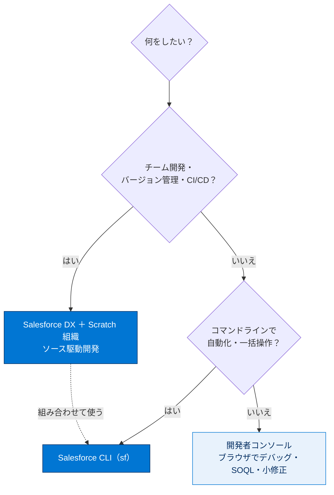
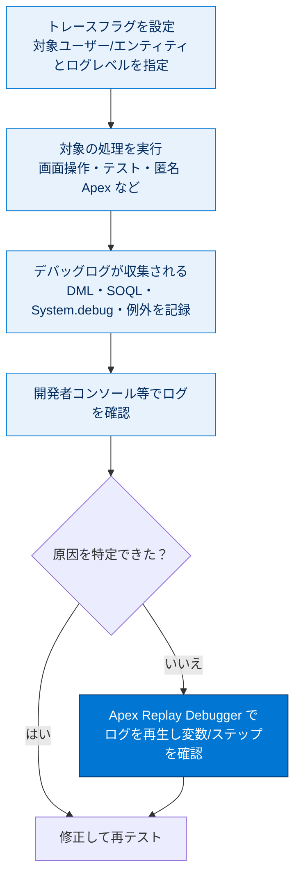
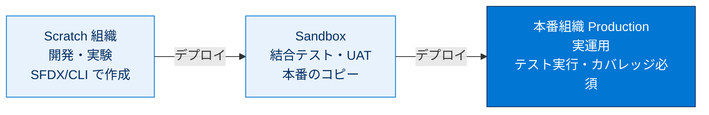
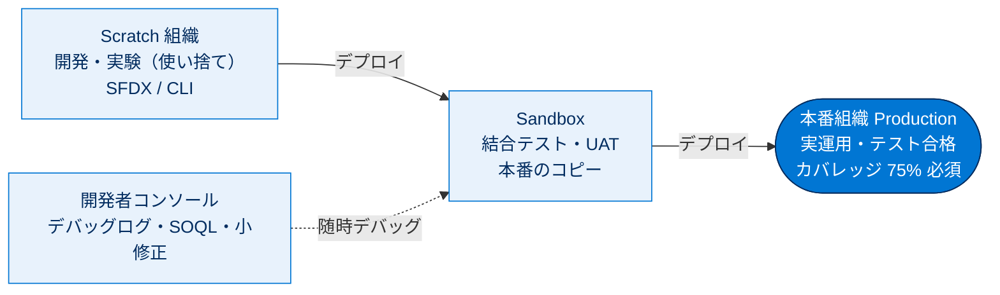

# デバッグとリリースの確認

## 学習の目的

この単元を完了すると、次のことができるようになります。

- Salesforce DX、Salesforce CLI、開発者コンソールなどの開発者ツールと、その使用場面を説明する。
- システムのデバッグと、フロー・プロセス・非同期/バッチジョブの監視方法を説明する。

> [!ポイント] この単元のゴール
>
> 試験直前の復習単元。「テスト、デバッグ、リリース」セクション（試験の **20%**）のうち**「デバッグ」と「リリース」トピック**を総ざらいする。中心は **Salesforce DX / Salesforce CLI / 開発者コンソール / デバッグログ / 各種環境（Sandbox など）**。「どのツールをどの場面で使うか」を整理する。

---

## 主なトピック

「テスト、デバッグ、リリース」セクションのデバッグとリリースを確認する。評価されるのはリリース / デバッグ / Salesforce DX / Salesforce CLI / 開発者コンソール。

> [!用語] デバッグとリリース
>
> - **デバッグ（Debug）**：バグの原因を調べて修正する作業。Salesforce では**デバッグログ**で実行を追跡し、**Apex Replay Debugger** で実行を再生して原因を特定する。
> - **リリース（デプロイ）**：開発した変更（Apex・コンポーネント・設定）をある環境から別の環境（最終的に本番）へ反映する作業。Sandbox や Scratch 組織で開発・検証してから本番へ展開する。

### この単元で復習する主なツール

| ツール | 種別 | 主な用途 | 使う場面 |
| --- | --- | --- | --- |
| **Salesforce DX（SFDX）** | 開発モデル/手法 | ソース駆動開発、Scratch 組織、バージョン管理連携 | チーム開発・CI/CD・モダンな開発全般 |
| **Salesforce CLI（`sf`）** | コマンドラインツール | 組織操作・デプロイ・テスト実行を自動化 | スクリプト化・CI/CD・大量操作 |
| **開発者コンソール** | ブラウザ内 IDE | コード編集・実行・デバッグログ確認・SOQL 実行 | 単発のデバッグ・クエリ確認・小修正 |

---

## Salesforce 開発者ツールの使い分け

> [!用語] Salesforce DX と Scratch 組織
>
> - **Salesforce DX（SFDX）**：モダンな開発のツール・手法の総称。**ソース（メタデータ）を真実の源**とし、Git と組み合わせ使い捨ての Scratch 組織で開発する「ソース駆動開発」を実現する。
> - **Scratch 組織**：設定をコードで定義できる**使い捨ての一時的な開発組織**。必要なとき作成し不要になれば破棄する。CI/CD 向き（既定で有効期間があり期限切れで消える）。

> [!用語] Salesforce CLI（`sf` コマンド）
>
> コマンドラインから組織を操作するツール。認証、メタデータの取得／デプロイ（`sf project deploy`）、テスト実行（`sf apex run test`）、Scratch 組織作成などを自動化できる。CI/CD パイプラインの中核。

**具体例：Salesforce CLI のよく使うコマンド**

```bash
# 組織にログイン（Web ログインで認証）
sf org login web --alias myorg

# Scratch 組織を作成
sf org create scratch --definition-file config/project-scratch-def.json

# ソース（メタデータ）を組織へデプロイ
sf project deploy start --target-org myorg

# Apex テストを実行してカバレッジを確認
sf apex run test --target-org myorg --code-coverage
```

> [!用語] 開発者コンソール（Developer Console）
>
> ブラウザ上で動く内蔵開発ツール。Apex やトリガーの編集・実行、**デバッグログ**の確認、**SOQL クエリ実行（Query Editor）**、匿名 Apex 実行、テスト実行ができる。単発のデバッグやクエリ確認に手軽。

> [!ポイント] ツール選びの考え方（頻出）
>
> - **チーム開発・バージョン管理・CI/CD** → Salesforce DX ＋ Salesforce CLI。
> - **コマンドラインで自動化・一括操作** → Salesforce CLI。
> - **ブラウザでサッとデバッグ・SOQL 確認・小修正** → 開発者コンソール。
> - これらは排他ではなく**組み合わせて**使う。

**ツール選定の判断フロー**



---

## デバッグの方法

> [!用語] デバッグログ / Apex Replay Debugger
>
> - **デバッグログ（Debug Log）**：トランザクション中のイベント（DML、SOQL、Apex 実行、例外、`System.debug` 出力など）を記録したログ。**トレースフラグ**を設定したユーザー/エンティティの処理が記録される。ログレベルで内容を絞れる。
> - **Apex Replay Debugger**：取得済みデバッグログをもとに実行を**再生**しながら変数やステップを確認するツール。VS Code（Salesforce 拡張）で利用する。

> [!例] System.debug でログに出力する
>
> コード中に `System.debug()` を置くと、その時点の値がデバッグログに出力される。原因調査の第一歩。

```apex
public class PriceCalculator {
    public static Decimal calc(Decimal unit, Integer qty) {
        Decimal total = unit * qty;
        // 計算結果をデバッグログに出力して値を確認する
        System.debug('単価=' + unit + ' 数量=' + qty + ' 合計=' + total);
        return total;
    }
}
```

> [!ポイント] デバッグ・監視で押さえる点
>
> - **デバッグログ**：トレースフラグを設定して取得。`System.debug` ＋ログレベルで内容を絞る。
> - **Apex Replay Debugger**：ログを再生して原因特定。
> - **非同期／バッチジョブの監視**：[設定 → Apex ジョブ] や [一括データジョブ] で状態（成功・失敗・処理件数）を確認。
> - **フロー／プロセスの監視**：フローのデバッグ機能やエラーメールで失敗箇所を確認。

**デバッグログ取得から原因特定までの流れ**



> [!注意] ガバナ制限超過はデバッグログに現れる
>
> SOQL 件数や DML 行数などの制限を超えると例外が発生し、デバッグログにスタックトレースとして記録される。**制限値（LIMIT_USAGE）** の行で、どのリソースを使い切ったか把握できる。

---

## リリース（環境の使い分け）

> [!用語] Sandbox（サンドボックス）
>
> 本番組織のコピーを使った開発・テスト・トレーニング用の隔離環境。種類により本番のデータ／設定をどこまで含むかが異なる（Developer / Developer Pro / Partial Copy / Full）。本番反映前の検証に使う。

> [!ポイント] 開発からリリースまでの環境の流れ
>
> | 環境 | 役割 |
> | --- | --- |
> | **Scratch 組織** | 機能単位の開発・実験（使い捨て、SFDX） |
> | **Sandbox** | 結合テスト・UAT・トレーニング（本番のコピー） |
> | **本番組織（Production）** | 実運用。リリース時はテスト実行・カバレッジ要件あり |



> [!注意] 本番リリースにはテストが必須
>
> 本番組織への Apex のデプロイでは、原則**テストが自動実行され、合格とコードカバレッジ（全体 75% 以上）が必要**。Sandbox や Scratch 組織で事前にテストを通しておくことがスムーズなリリースの鍵。

---

## 練習問題とフラッシュカード（自己診断）

対話型の練習問題（**採点対象ではない**）と、**デバッグログ・各種環境**を扱うフラッシュカードがある。

> [!手順] 練習問題・フラッシュカードの進め方
>
> 1. 練習問題：シナリオを読み解答をクリック（複数正解あり）→ **[Submit]** で正誤と理由を確認。説明が長ければ **[Expand]**。
> 2. フラッシュカード：問題・用語を読み、カードをクリックで正解表示。矢印で前後へ移動。

---

## 関連バッジ

| バッジ | コンテンツタイプ |
| --- | --- |
| **開発者コンソールの基礎** | モジュール |
| **コマンドラインインターフェース** | モジュール |
| **クイックスタート: Salesforce DX** | プロジェクト |
| **組織開発モデル** | モジュール |
| **Apex Replay Debugger でバグを見つけて修正する** | プロジェクト |

> [!例] 目的別おすすめバッジ
>
> - ブラウザでのデバッグ・SOQL 実行 → 「**開発者コンソールの基礎**」
> - CLI の使い方 → 「**コマンドラインインターフェース**」
> - SFDX とソース駆動開発 → 「**クイックスタート: Salesforce DX**」「**組織開発モデル**」
> - リプレイデバッグ → 「**Apex Replay Debugger でバグを見つけて修正する**」

---

## 試験対策：押さえておきたいポイント

> [!ポイント] ツールと用途の対応（暗記）
>
> | やりたいこと | 使うツール |
> | --- | --- |
> | ソース駆動・チーム開発・使い捨て組織 | **Salesforce DX ＋ Scratch 組織** |
> | コマンドラインで自動化・CI/CD | **Salesforce CLI（`sf`）** |
> | ブラウザでデバッグログ確認・SOQL 実行・小修正 | **開発者コンソール** |
> | 実行を再生して原因特定 | **Apex Replay Debugger（VS Code）** |
> | 本番のコピーで結合テスト・UAT | **Sandbox** |

> [!ポイント] 重要数値・前提
>
> - 「テスト、デバッグ、リリース」セクションは試験の **20%**。
> - 本番デプロイには**テスト合格＋全体カバレッジ 75% 以上**が必要。
> - Sandbox は種類（Developer / Developer Pro / Partial Copy / Full）で**データ量・更新頻度**が異なる。

> [!まとめ] この単元の要点
>
> - 開発者ツールは **Salesforce DX / Salesforce CLI / 開発者コンソール** の3本柱。場面で使い分ける。
> - デバッグは **デバッグログ（トレースフラグ）＋ `System.debug` ＋ Apex Replay Debugger**、非同期/バッチは**ジョブ監視**で追う。
> - リリースは **Scratch 組織 → Sandbox → 本番**の流れ。本番は**テスト・カバレッジ 75%** が前提。

---

## テスト（+100 ポイント）

### 問題 1

デバッグとリリースのトピックの準備のため、どの Salesforce 開発者ツールに精通しておく必要がありますか？

- A. Sandbox
- B. Salesforce DX
- C. 開発者コンソール
- D. A と C
- E. B と C

### 問題 2

組織内でアプリケーションのデバッグができる場所について学習するのに役立つ Trailhead モジュールはどれですか？

- A. 開発者コンソールの基礎
- B. デバッグドキュメント
- C. プラットフォーム開発の基礎
- D. Apex テスト

> [!注意] 日本語環境で受講する場合
>
> 本単元は Trailhead の日本語教材の抽出。練習問題・フラッシュカード・テストは Trailhead 該当モジュール上で操作する。用語の英語名も英語出題に備えて確認しておくとよい。

---

## 🎓 この単元のまとめ

この単元では、「テスト、デバッグ、リリース（20%）」セクションの「デバッグ」と「リリース」を確認し、開発者ツール3本柱（Salesforce DX / Salesforce CLI / 開発者コンソール）の使い分けと、デバッグログ・各種環境（Scratch 組織 / Sandbox / 本番）の役割を整理しました。

次の図は、開発から本番リリースまでの環境の流れと、それぞれで使う主なツールを俯瞰したものです。



> [!まとめ] この単元の要点
>
> - 開発者ツールは **Salesforce DX / Salesforce CLI / 開発者コンソール** の3本柱を場面で使い分ける。
> - **DX ＋ Scratch 組織**＝ソース駆動・チーム開発、**CLI（`sf`）**＝自動化・CI/CD、**開発者コンソール**＝ブラウザでデバッグ・SOQL・小修正。
> - デバッグは **デバッグログ（トレースフラグ）＋ `System.debug` ＋ Apex Replay Debugger**、非同期/バッチは**ジョブ監視**。
> - リリースは **Scratch 組織 → Sandbox → 本番**の流れ。
> - 本番デプロイは**テスト合格＋全体カバレッジ 75% 以上**が前提。

> [!豆知識] Scratch 組織は「使い捨て」、Sandbox は「本番のコピー」
>
> 似て見える2つの開発環境ですが性格は対照的です。**Scratch 組織**は設定をコードで定義してさっと作り、期限が来れば消える文字どおりの使い捨て環境で、機能単位の開発や CI/CD に向きます。一方 **Sandbox** は本番組織のコピーで、結合テストや UAT・トレーニングに使い、種類（Developer / Developer Pro / Partial Copy / Full）によって含むデータ量が変わります。「コードで作る使い捨て＝Scratch、本番のコピー＝Sandbox」と覚えると、ツール選定の設問で迷いません。
