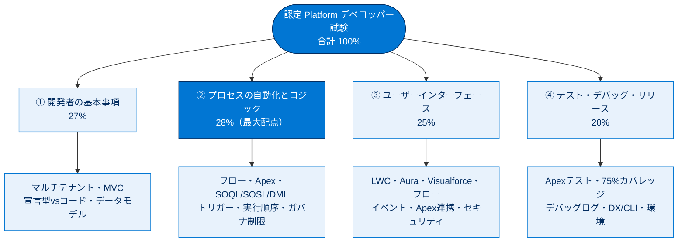

# Platform デベロッパー試験に向けた学習 総まとめ

このトピックは、認定 Platform デベロッパー試験の**直前復習**を目的とした横断モジュール群です。試験は4つのセクション（開発者の基本事項 27% / プロセスの自動化とロジック 28% / ユーザーインターフェース 25% / テスト・デバッグ・リリース 20%）で構成され、本トピックの各ユニットはそれぞれのセクションの要点・頻出論点・暗記値を凝縮しています。新しい知識を増やすより、**配点に応じて学習時間を配分し、頻出値を確実に思い出せる状態に仕上げる**ことがゴールです。この総まとめは「試験前に一気に見返す1枚」として活用してください。

---

## 全体像：4セクションと配点

次の図は、試験の4セクション・配点・各セクションの中核トピックを1枚で俯瞰したものです。配点上位の ①②（合計 55%）を最優先で固めます。

---

## ユニット横断早見表

| ユニット | 対応セクション（配点） | キーワード | 一言要点 |
| --- | --- | --- | --- |
| 認定資格学習ガイド | 全体 | 配点 27/28/25/20・受験ポリシー・資格更新 | 試験の枠組みと「協力OK・不正NG」「年1回更新」を把握 |
| 開発者の基本事項を確認する | ① 開発者の基本事項（27%） | マルチテナント・MVC・宣言型vsコード・外部ID・Agentforce | 土台概念と「宣言型を優先」の設計方針 |
| 宣言機能と Apex の基本構成概念 | ② 自動化とロジック（28%） | フロー・承認プロセス・変数/定数/メソッド・フロー制御 | 宣言型の自動化と Apex の基本パーツ |
| SOQL / SOSL / DML の復習 | ② 自動化とロジック（28%） | SOQL・SOSL・DML・ガバナ制限・バルク化・例外処理 | 照会/全文検索/書き込みの区別とバルク化 |
| Apex クラスとトリガーの学習 | ② 自動化とロジック（28%） | トリガー・before/after・実行の保存順序・再帰・カスケード | 実行順序とトリガーのベストプラクティス |
| Visualforce の学習 | ③ ユーザーインターフェース（25%） | LWC/Aura/VF/フロー・XSS・SOQLインジェクション・with sharing | UI技術の使い分けと脆弱性対策 |
| Lightning コンポーネントフレームワーク | ③ ユーザーインターフェース（25%） | LWC・@api・@wire・CustomEvent・@AuraEnabled・@InvocableMethod・LMS | イベント方向と Apex 連携の作法 |
| テストの復習 | ④ テスト・デバッグ・リリース（20%） | @isTest・75%カバレッジ・SeeAllData=false・Test.startTest/stopTest | テストの要件・データ・実行・観点 |
| デバッグとリリースの確認 | ④ テスト・デバッグ・リリース（20%） | Salesforce DX・CLI・開発者コンソール・デバッグログ・Sandbox | ツールの使い分けと環境の流れ |

---

## 🎯 試験頻出ポイント

> [!ポイント] セクション横断で狙われる暗記値・論点
>
> | 論点 | 押さえる内容 |
> | --- | --- |
> | セクション配点 | **27 / 28 / 25 / 20**（合計 100%）。最大は②自動化とロジック（28%） |
> | 設計の基本方針 | **宣言型を優先**し、複雑要件のときだけ Apex（最小限の労力＝ベストプラクティス） |
> | 主要ガバナ制限 | **SOQL 100 回・取得 50,000 件／DML 150 回・処理 10,000 件／SOSL 20 回** |
> | バルク化 | **for ループ内で SOQL/DML を書かない**。ループ外でまとめて実行 |
> | SOQL vs SOSL | 条件指定の1オブジェクト＝**SOQL**、複数オブジェクト横断の全文検索＝**SOSL** |
> | 実行の保存順序 | **before トリガー → 入力規則 → after トリガー → 集計・フロー → コミット** |
> | before vs after | before＝同一レコード変更（追加DML不要）／after＝確定IDで関連操作 |
> | UI 技術 | 新規は **LWC**、PDF/帳票は **Visualforce（renderAs=pdf）**、ノーコードは **フロー** |
> | LWC イベント | 子→親＝**CustomEvent**、親→子＝**@api**、無関係間＝**LMS** |
> | Apex 連携 | LWC＝**@AuraEnabled**（読み取りは cacheable=true）、フロー/Agentforce＝**@InvocableMethod**（List） |
> | セキュリティ | Apex は既定でシステムモード。UI 経由は **with sharing ＋ WITH SECURITY_ENFORCED** |
> | テストの必須要件 | **@isTest**、本番リリースに**全体カバレッジ 75% 以上**、テストは全パス |
> | テストの仕掛け | **Test.startTest/stopTest**（制限リセット・非同期同期完了）、**SeeAllData=false**、**@TestSetup** |
> | 開発者ツール | **DX＋Scratch組織**／**CLI（sf）**／**開発者コンソール**／**Apex Replay Debugger** |
> | 環境の流れ | **Scratch 組織 → Sandbox → 本番**（本番はテスト合格＋75%必須） |

---

## 📖 用語早見表

| 用語 | ひとことの意味 |
| --- | --- |
| マルチテナント | 1つの基盤を複数顧客で共有する仕組み（ゆえにガバナ制限が必要） |
| ガバナ制限 | 1トランザクションの実行上限（SOQL 100回・DML 150回 など） |
| MVC | Model=オブジェクト／View=画面・Lightning／Controller=Apex の3層設計 |
| 宣言型 / プログラミング型 | クリック設定で実現／Apex コードで実現 |
| 外部 ID | 他システムの ID を保持し UPSERT 等で一意特定できる項目属性 |
| SOQL | レコードを照会（読み取り）する言語（SELECT FROM WHERE） |
| SOSL | 複数オブジェクト横断の全文検索言語（FIND IN RETURNING） |
| DML | レコードの作成・更新・削除など書き込み操作 |
| バルク化 | ループ内で SOQL/DML せず、まとめて1回実行する設計 |
| トリガー | レコード保存イベントで自動実行される Apex（before / after） |
| 実行の保存順序 | 保存時に各処理が走る順番（試験最重要テーマ） |
| 再帰 / カスケード | トリガーの自己再呼び出し／処理の連鎖起動 |
| LWC | Web 標準ベースの最新 UI フレームワーク（新規開発の第一推奨） |
| @AuraEnabled / @InvocableMethod | LWC から呼べる／フロー・Agentforce から呼べる Apex メソッド指定 |
| with sharing / WITH SECURITY_ENFORCED | 共有設定の尊重／CRUD・FLS を強制するセキュリティ指定 |
| コードカバレッジ | テストで実行された Apex の割合（本番は全体 75% 以上が必要） |
| Test.startTest() / stopTest() | ガバナ制限をリセットし、間で非同期処理を同期完了させるテスト用メソッド |
| Salesforce DX / CLI | ソース駆動開発の手法／コマンドライン操作ツール（sf） |
| Scratch 組織 / Sandbox | 使い捨ての開発組織／本番のコピー環境 |

---

> [!豆知識] 「合格点は公開されていない」
>
> Salesforce 認定試験の合格ラインは公式には明示されておらず、目安としておよそ 65〜70% 前後とされることが多いです。だからこそ配点の大きいセクション（②自動化とロジック 28%、①開発者の基本事項 27%）で確実に得点することが合格戦略の柱になります。1問の重みはセクションの配点と問題数で決まるため、「①②で 55%」を取りこぼさないことが何より効きます。

> [!豆知識] 4セクションは「作る流れ」とほぼ同じ順番
>
> ①基本事項（土台を理解）→ ②自動化とロジック（サーバー側のロジックを作る）→ ③ユーザーインターフェース（画面を作る）→ ④テスト・デバッグ・リリース（検証して本番へ出す）。試験のセクション順は、実際の開発の流れ（設計 → ロジック → UI → テスト・リリース）とほぼ一致します。順番に意味を持たせて覚えると、どのトピックがどのセクションに属するか迷いません。

> [!豆知識] 「ガバナ制限」と「75% カバレッジ」はマルチテナントが生んだ双子のルール
>
> ループ内 SOQL/DML を禁じるガバナ制限も、本番リリースに 75% カバレッジを課すルールも、根っこは同じ「**1つの基盤を全顧客で共有している**（マルチテナント）」から来ています。誰か1人の暴走したコードが全員に影響しないよう実行を縛り（ガバナ制限）、本番に出す前にコードの品質を担保させる（カバレッジ）。この共通の背景を理解しておくと、個別の数値も「なぜ必要か」とセットで記憶に残ります。

---

## ✅ 理解度セルフチェック

> [!まとめ] 試験前の最終確認（答えも併記）
>
> 1. 試験の4セクションの配点は？ → **27%（基本事項）/ 28%（自動化とロジック）/ 25%（UI）/ 20%（テスト・デバッグ・リリース）**。最大は自動化とロジック。
> 2. 「条件が明確な1オブジェクトから取得」「複数オブジェクト横断の全文検索」はそれぞれ何を使う？ → 前者は **SOQL**、後者は **SOSL**。
> 3. 新規レコードの確定 ID を使って関連レコードを操作したい。before / after どちらのトリガー？ → **after**（before では Id がまだ無い）。
> 4. 実行の保存順序で、before トリガーと after トリガーの間に評価されるのは？ → **入力規則**（before → 入力規則 → after の順）。
> 5. LWC から呼ぶ Apex メソッドに必要なアノテーションは？ 読み取り専用にしたいときは？ → **@AuraEnabled**、読み取り専用は **cacheable=true**（DML 不可になる）。
> 6. 本番リリースに必要な全体コードカバレッジは？ テストクラスに付けるアノテーションは？ → **75% 以上**、**@isTest**。
