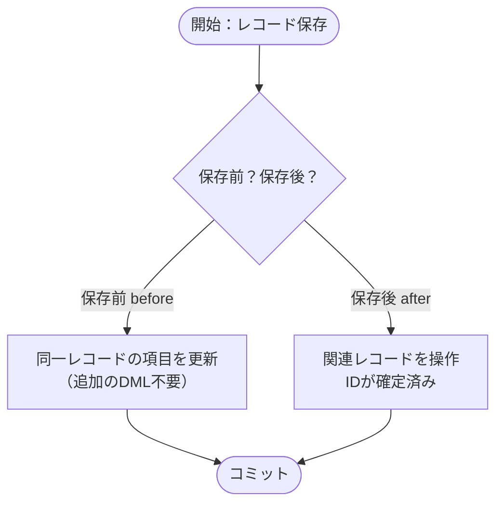
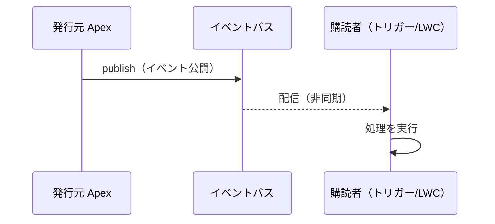
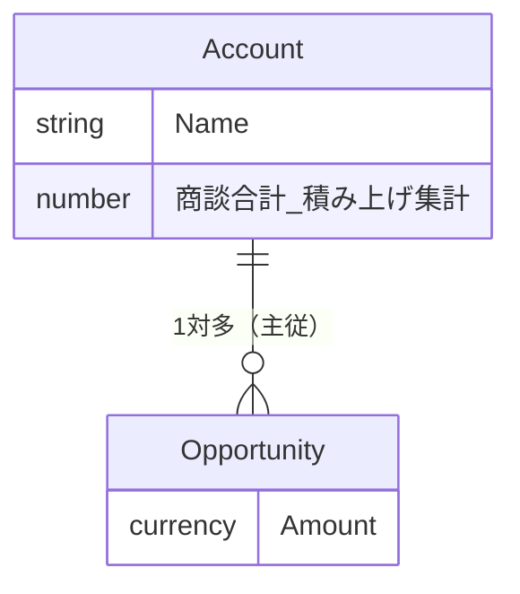

# Mermaid 図解 追加仕様書（全エージェント共通）

すでに整形・スリム化済みの教材ユニット（Markdown）に、**Mermaid 図**を追加して「本当に視覚的に分かりやすい」状態にする。指定ファイルを**その場で上書き**する。

## ゴール
- 各ユニットに、内容理解を助ける **Mermaid 図を 1〜3 個**追加する（その単元の核心＝処理の流れ・関係・順序・判断分岐・やり取り）。
- 既存の ` ```text ` の ASCII 図のうち、**フロー/関係/順序/相互作用を表すもの**は ` ```mermaid ` に**置き換える**（より見やすくなる）。ファイルツリー・コマンド出力・CSV など図でないものは ` ```text ` のまま残す。
- 図を入れても価値が薄い箇所には無理に入れない。**意味のある図だけ**。

## 厳守：壊れない Mermaid の書き方（構文エラー防止）
描画エラーを避けるため、**必ず**次を守る:
1. ノードIDは半角英数字のみ（例 `A`, `B`, `N1`）。日本語をIDにしない。
2. **ノードのラベルは必ずダブルクオートで囲む**：`A["取引先 Account"]`。日本語・記号はクオート内なら安全。
3. ラベル内の改行は `<br/>`。ラベル内でダブルクオートを使わない（必要なら「」を使う）。ラベル内に `()[]{}` を入れる場合も必ずクオート内に収める。
4. 判断分岐（ひし形）は `X{"条件？"}`。
5. エッジのラベルはクオートで：`A -->|"はい"| B`、`A -.->|"非同期"| B`。
6. ノード数は **5〜12 個**程度に抑える（大きすぎる図は読みにくい・壊れやすい）。
7. 1つの ```mermaid ブロックに**1つの図**。先頭行で図種別を宣言（`flowchart TD` 等）。

## 使う図の種類（用途別）
- **flowchart TD / LR**：処理の流れ・手順・判断分岐・実行順序・分類ツリー。
  例：トリガーの保存順序、承認プロセス、非同期Apexの種別選択、検索ソリューション選定。
- **sequenceDiagram**：時間的なやり取り・相互作用。
  例：プラットフォームイベントの publish/subscribe、要求/応答、LWC 親子のイベント、クライアント↔サーバー、Apex→DB。
- **erDiagram**：オブジェクトのデータモデル・リレーション。
  例：取引先と商談、主従/参照関係、カスタムオブジェクトの関連。

## 配色（任意・推奨）
Salesforce 配色にしたい場合は flowchart 末尾に付ける（任意。付けなくてよい）:
```
    classDef hl fill:#0176D3,stroke:#032D60,color:#fff;
    classDef soft fill:#E8F2FC,stroke:#0176D3,color:#032D60;
    class A hl;
    class B,C soft;
```

## 記述例（そのまま参考に）

**フローチャート（判断分岐）**


**シーケンス（pub/sub）**


**ER（リレーション）**


## 厳守事項（その他）
- 既存の見出し・学習の目的・コールアウト6種（記法＝マーカー行の次に空の `>` 行）・表・コード例・Challenge設定値・API名は**削らない/変えない**。図の**追加**と ASCII図→mermaid の**置換**のみ。
- 全文日本語。図のラベルも日本語でよい（クオート必須）。
- 書き込み後に Read で、```mermaid ブロックが上記ルール（ラベルのクオート、ID半角、改行 `<br/>`）を満たしているか自己確認する。Write が確定しなければ再実行。

## 返却
担当した各ファイルについて「パス / 追加・置換した Mermaid 図の数と種類（flowchart/sequence/er）/ 図のテーマ」を簡潔に報告する。
