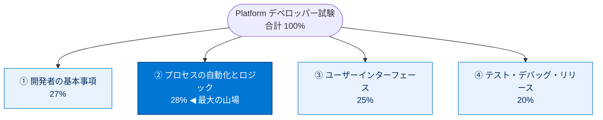
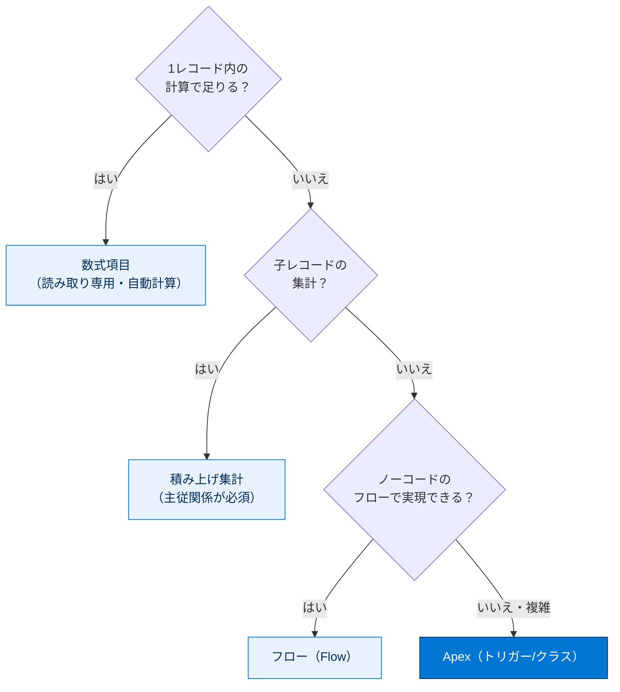
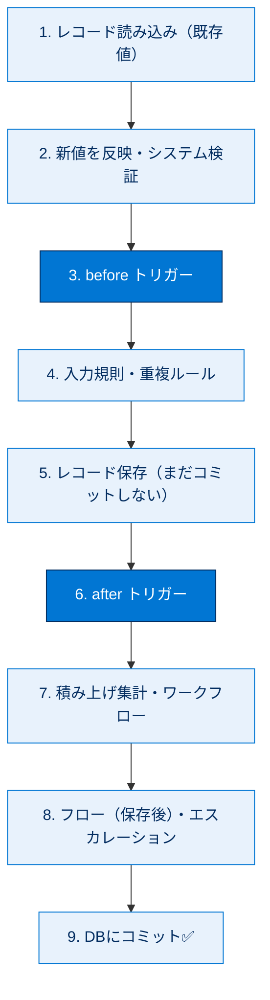
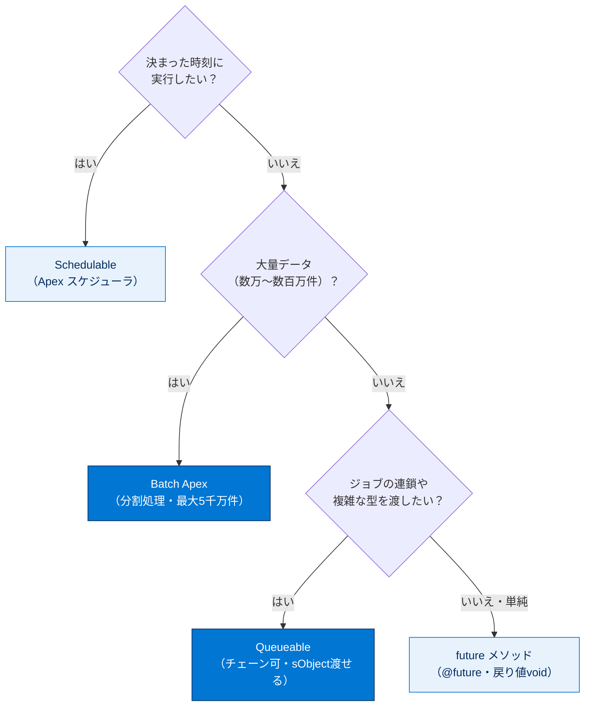
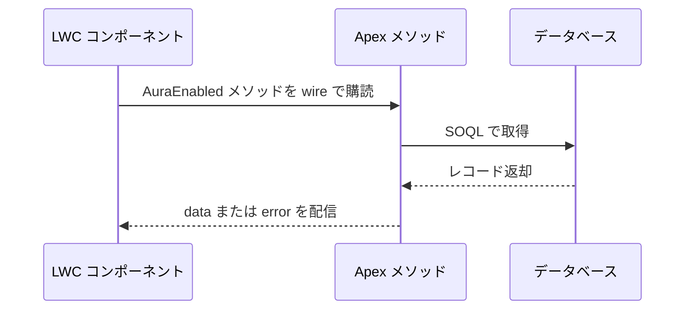

# 🎀 直前まとめチートシート

やっほー！👋✨ ウチが試験範囲ぜーんぶギュッと絞ってまとめたから、ここだけは絶対おさえてこ💪💯
細かい解説は各ユニットを見てね。**このページは「最後の総ざらい」用**だよ〜😎

> [!ポイント] 試験のキホン情報（ここマジ大事）
>
> - 4セクション構成、配点は **27 / 28 / 25 / 20**（合計100%）。
> - **②自動化とロジック（28%）＋①基本（27%）= 55%**！まずここ固めたら勝ち確🔥
> - 合格ラインの目安は **68%**くらい。択一＆複数選択でだいたい60問。

---

## 🗺 まずは全体マップ

| セクション | 配点 | ざっくり内容 |
| --- | --- | --- |
| ① 開発者の基本事項 | **27%** | マルチテナント、MVC、データモデル、宣言型 vs Apex |
| ② プロセスの自動化とロジック | **28%** | Apex・SOQL/SOSL/DML・トリガー・フロー・ガバナ制限 |
| ③ ユーザーインターフェース | **25%** | LWC・Aura・Visualforce |
| ④ テスト・デバッグ・リリース | **20%** | Apexテスト・デバッグログ・デプロイ |

---

## 🧩 ① 開発者の基本事項

> [!まとめ] ここだけは押さえる
>
> - **マルチテナント**：1つの基盤を全社で共有 → だから**ガバナ制限**がある（独り占め禁止✋）。
> - **MVC**：Model（オブジェクト/項目）・View（画面=LWC/VF）・Controller（ロジック=Apex）。
> - **メタデータ駆動**：設定もコードもメタデータ。だから宣言的に作れる。

**自動化は「まず宣言型、ダメならApex」がド定番😎**

> [!注意] リレーションのひっかけ⚠️
>
> - **主従（Master-Detail）**：親消すと子も消える🪦／子は親必須／**積み上げ集計が使える**／子に所有者なし。
> - **参照（Lookup）**：ゆるい関係／親消しても子は残る／積み上げ集計は標準では不可。
> - 「積み上げ集計したい」と来たら **主従関係**！これ鉄板の出題パターン💯

---

## ⚙️ ② プロセスの自動化とロジック（最重要・28%）

### 🔑 SOQL / SOSL / DML 使い分け

| やりたいこと | 使うやつ | ひとこと |
| --- | --- | --- |
| 特定オブジェクトを条件で取得 | **SOQL** | `[SELECT Id FROM Account WHERE ...]` |
| 複数オブジェクトを横断テキスト検索 | **SOSL** | `FIND 'スミス' IN ALL FIELDS RETURNING ...` |
| レコードの作成・更新・削除 | **DML** | `insert` / `update` / `upsert` / `delete` |

> [!ポイント] SOQL vs SOSL の見分け（超頻出✨）
>
> - **どのオブジェクトか分かってる** → SOQL。
> - **キーワードを複数オブジェクトから探す・あいまい検索** → SOSL。
> - SOQL は最大2万件、SOSL は最大2千件返す。SOSL は**テキスト検索インデックス**を使うよ。

> [!注意] DML のひっかけ⚠️
>
> - `upsert`：あれば更新・なければ作成（**外部ID or Id** で判定）。
> - `merge`：取引先・取引先責任者・リードだけ、最大3件マージ。
> - `Database.insert(list, false)`：**部分成功**を許可（全部こけない）。`insert list;` は1件でもダメなら**全ロールバック**。

### 🧱 Apex の基本

> [!用語] sObject（エスオブジェクト）
>
> Salesforce のレコードを表すデータ型。`Account a = new Account(Name='Acme');` みたいに使う。DB の1行 = 1 sObject だよ。

> [!まとめ] コレクション3兄弟（マジ頻出）
>
> - **List**：順番あり・重複OK（`List<Account>`）。
> - **Set**：重複なし・順番なし。
> - **Map**：キーと値のペア（`Map<Id, Account>`）。トリガーで超使う！

### ⚡ トリガー（ここが28%の主役）

> [!ポイント] コンテキスト変数（暗記マスト📝）
>
> | 変数 | 中身 | 使える場面 |
> | --- | --- | --- |
> | `Trigger.new` | 新しい値のリスト | insert / update（**before/after**） |
> | `Trigger.old` | 古い値のリスト | update / delete |
> | `Trigger.newMap` | ID→新レコードのMap | update / after insert |
> | `Trigger.oldMap` | ID→旧レコードのMap | update / delete |
> | `Trigger.isBefore/isAfter` | タイミング判定 | 全部 |

> [!注意] before と after の使い分け（ド頻出⚠️）
>
> - **before**：同じレコードの**項目を更新**するなら before（DML不要でそのまま代入✨）。
> - **after**：**レコードIDが必要**な処理（関連レコード作成・他オブジェクト更新）は after。
> - after では `Trigger.new` のレコードは**読み取り専用**！更新しようとするとエラー💥

**トリガーの保存実行順（Order of Execution）ざっくり版👇**

> [!ポイント] 一括化（バルク化）＝トリガー設計の命🔥
>
> - **ループの中で SOQL / DML は絶対NG**🙅‍♀️ → ガバナ制限に即死。
> - SOQL は**ループの外で1回**。`WHERE Id IN :Trigger.new` でまとめて取得。
> - 更新するレコードは **List に溜めて、ループの外で1回 DML**。
> - トリガーは**1回200件**のバッチで動く前提でコード書く！

### ⏳ 非同期 Apex の使い分け（決定木で覚えて✨）

> [!注意] 非同期のひっかけ⚠️
>
> - `@future` は **戻り値 void**・引数は**プリミティブのみ**（sObject ❌）・future から future ❌。
> - **コールアウト**（外部API）するなら `@future(callout=true)`。
> - Batch は `Database.Batchable` を実装（**start → execute（200件ずつ）→ finish**）。
> - Queueable は **sObject も渡せる**し**チェーン**もできる（future の上位互換的存在😎）。

---

## 📊 ガバナ制限 早見表（暗記ゾーン📝🔥）

> [!ポイント] これ覚えたら自動化セクションがグッと楽になる
>
> | 制限 | 同期 | 非同期 |
> | --- | --- | --- |
> | SOQL クエリ発行数 | **100** | 200 |
> | SOQL 取得行数 | 50,000 | 50,000 |
> | DML ステートメント数 | **150** | 150 |
> | DML 処理行数 | 10,000 | 10,000 |
> | SOSL クエリ数 | 20 | 20 |
> | CPU 時間 | 10,000ms | 60,000ms |
> | ヒープサイズ | 6 MB | 12 MB |

> [!注意] 数字のゴロ合わせ💡
>
> 「**SOQL は100、DML は150**」だけは絶対！ここ間違えると一気に失点だよ〜😢
> 行数系は「**SOQL 5万行・DML 1万行**」でセット暗記。

---

## 🎨 ③ ユーザーインターフェース（25%）

> [!まとめ] UI技術 早わかり
>
> | 技術 | 何者？ | いつ使う |
> | --- | --- | --- |
> | **LWC** | Web標準ベースの最新コンポーネント | **新規開発の第一選択**✨ |
> | **Aura** | 旧世代のコンポーネント | 既存資産の保守 |
> | **Visualforce** | 古いページベースのUI | レガシー・PDF出力など |

> [!ポイント] LWC の超重要キーワード
>
> | デコレータ | 役割 |
> | --- | --- |
> | `@api` | プロパティ/メソッドを**公開**（親→子で値渡し） |
> | `@track` | オブジェクト/配列の内部変更を追跡 |
> | `@wire` | Apex や UI API から**リアクティブにデータ取得** |

> [!注意] LWC イベントの向き（ひっかけ注意⚠️）
>
> - **子 → 親**：`CustomEvent` を `dispatchEvent` で発火、親は `on○○` で受ける。
> - **親 → 子**：子の `@api` プロパティに値を渡す。
> - **無関係どうし**：**LMS（Lightning Message Service）** で通信。

**LWC が Apex を呼ぶ流れ（@wire のイメージ）**

> [!ポイント] Apex 連携の作法（出る！）
>
> - LWC から呼ぶ → **`@AuraEnabled`**（読み取り専用は `cacheable=true`、付けると **DML不可**）。
> - フロー / Agentforce から呼ぶ → **`@InvocableMethod`**（引数・戻り値は **List**）。

---

## 🧪 ④ テスト・デバッグ・リリース（20%）

> [!ポイント] Apex テストの鉄則（毎回出る💯）
>
> - 本番デプロイには**全体コードカバレッジ 75% 以上**＋**全テスト合格**が必須。
> - テストメソッドは **`@isTest`**。テストクラスにも `@isTest`。
> - **`Test.startTest()` / `Test.stopTest()`** の間で対象を実行 → **ガバナ制限がリセット**＆非同期もここで完了。
> - **`@testSetup`** で共通テストデータを1回作成（使い回し）。
> - テストは**自分でデータを作る**のが原則（`@isTest(SeeAllData=true)` は基本使わない🙅‍♀️）。
> - コールアウトのテストは **`Test.setMock`** でモック。

> [!用語] アサーション（Assert）
>
> 期待値どおりか確認する命綱。`Assert.areEqual(期待, 実際);` みたいに書く。これが無いテストは意味ナシ❌

> [!まとめ] デバッグ & リリース道具箱
>
> - **デバッグログ**：トレースフラグ設定 → `System.debug()` ＋ ログレベルで追う。
> - **Apex Replay Debugger**：ログを**再生**して変数チェック（VS Code）。
> - **環境の流れ**：Scratch組織（開発）→ Sandbox（テスト/UAT）→ **本番**。
> - **DX / CLI**：ソース駆動開発＆CI/CD。コンソールはサッと確認用。

> [!注意] Sandbox 種別（地味に出る⚠️）
>
> Developer / Developer Pro / Partial Copy / **Full**。右にいくほど本番データを多く含む。Full だけ本番の全データコピー🗂

---

## 🔐 セキュリティ（②④にまたがる頻出ネタ）

> [!ポイント] 鉄板の防御パターン
>
> - **`with sharing`**：実行ユーザーの共有設定を尊重（デフォは `without sharing` 相当に注意）。
> - **SOQLインジェクション対策**：**バインド変数**（`:変数`）を使う！動的SOQLの文字列連結は危険💥 → `String.escapeSingleQuotes()`。
> - **CRUD/FLS**：`WITH USER_MODE`・`WITH SECURITY_ENFORCED`・`Security.stripInaccessible()`。
> - **CSRF / SSRF**：勝手なリクエスト/内部アクセスを防ぐ。許可リストで宛先を絞る。

---

## ✅ 直前チェックリスト（試験前に流し読み👀）

> [!まとめ] これ全部「うん！」って言えたら準備OK😎🎉
>
> - [ ] 主従 vs 参照、積み上げ集計は主従が必須 → 言える？
> - [ ] SOQL=100 / DML=150、行数 5万 / 1万 → 即答できる？
> - [ ] before（項目更新）/ after（ID必要・関連操作）の違い → OK？
> - [ ] トリガーは**ループ外でSOQL/DML**・200件前提 → 染み付いてる？
> - [ ] future / Batch / Queueable / Schedulable の使い分け → 決定木で出る？
> - [ ] 実行順序：before → 検証 → 保存 → after → 集計/WF → コミット → 言える？
> - [ ] テスト 75%・startTest/stopTest・@testSetup・setMock → バッチリ？
> - [ ] LWC：@api/@wire、子→親はCustomEvent、@AuraEnabled → OK？
> - [ ] with sharing ＆ バインド変数でインジェクション対策 → OK？

ここまで来たアナタは超エラい！🙌💖 あとは自信もって本番いってこ〜！受かったら教えてね🍀✨

---

> [!注意] このページについて
>
> これは**要点だけ**を絞ったチートシートだよ。あいまいな所は各トピックの詳しいユニットに戻って確認してね📖 トップに戻るには上の「学習ノートへ」リンクからどうぞ！
